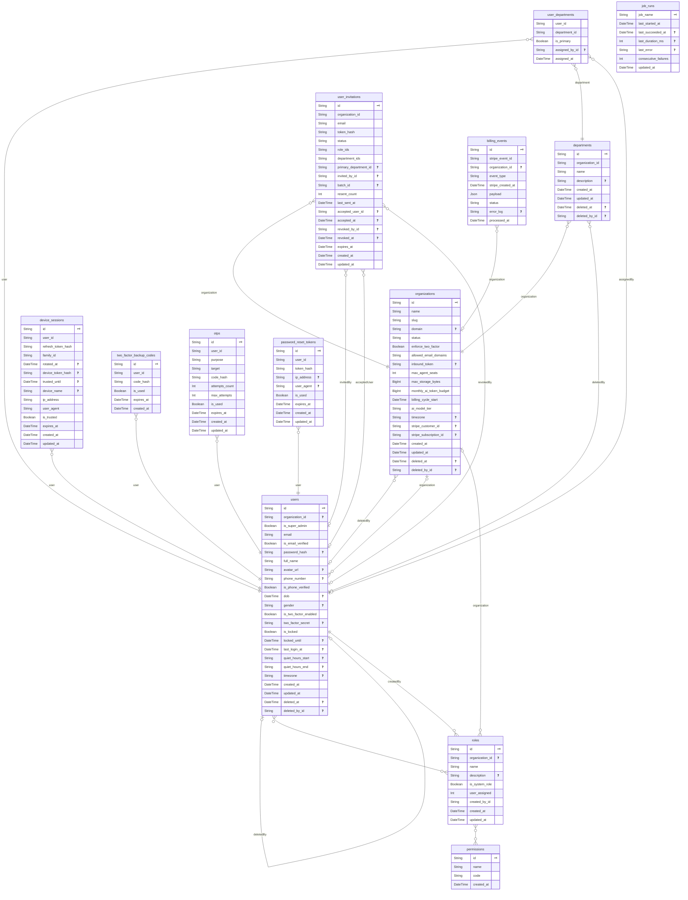

```mermaid
erDiagram

  "organizations" {
    String id "🗝️"
    String name 
    String slug 
    String domain "❓"
    String status 
    Boolean enforce_two_factor 
    String allowed_email_domains 
    String inbound_token "❓"
    Int max_agent_seats 
    BigInt max_storage_bytes 
    BigInt monthly_ai_token_budget 
    DateTime billing_cycle_start 
    String ai_model_tier 
    String timezone "❓"
    String stripe_customer_id "❓"
    String stripe_subscription_id "❓"
    DateTime created_at 
    DateTime updated_at 
    DateTime deleted_at "❓"
    String deleted_by_id "❓"
    }
  

  "departments" {
    String id "🗝️"
    String organization_id 
    String name 
    String description "❓"
    DateTime created_at 
    DateTime updated_at 
    DateTime deleted_at "❓"
    String deleted_by_id "❓"
    }
  

  "users" {
    String id "🗝️"
    String organization_id "❓"
    Boolean is_super_admin 
    String email 
    Boolean is_email_verified 
    String password_hash "❓"
    String full_name 
    String avatar_url "❓"
    String phone_number "❓"
    Boolean is_phone_verified 
    DateTime dob "❓"
    String gender "❓"
    Boolean is_two_factor_enabled 
    String two_factor_secret "❓"
    Boolean is_locked 
    DateTime locked_until "❓"
    DateTime last_login_at "❓"
    String quiet_hours_start "❓"
    String quiet_hours_end "❓"
    String timezone "❓"
    DateTime created_at 
    DateTime updated_at 
    DateTime deleted_at "❓"
    String deleted_by_id "❓"
    }
  

  "user_departments" {
    String user_id 
    String department_id 
    Boolean is_primary 
    String assigned_by_id "❓"
    DateTime assigned_at 
    }
  

  "roles" {
    String id "🗝️"
    String organization_id "❓"
    String name 
    String description "❓"
    Boolean is_system_role 
    Int user_assigned 
    String created_by_id 
    DateTime created_at 
    DateTime updated_at 
    }
  

  "permissions" {
    String id "🗝️"
    String name 
    String code 
    DateTime created_at 
    }
  

  "device_sessions" {
    String id "🗝️"
    String user_id 
    String refresh_token_hash 
    String family_id 
    DateTime rotated_at "❓"
    String device_token_hash "❓"
    DateTime trusted_until "❓"
    String device_name "❓"
    String ip_address 
    String user_agent 
    Boolean is_trusted 
    DateTime expires_at 
    DateTime created_at 
    DateTime updated_at 
    }
  

  "two_factor_backup_codes" {
    String id "🗝️"
    String user_id 
    String code_hash 
    Boolean is_used 
    DateTime expires_at 
    DateTime created_at 
    }
  

  "otps" {
    String id "🗝️"
    String user_id 
    String purpose 
    String target 
    String code_hash 
    Int attempts_count 
    Int max_attempts 
    Boolean is_used 
    DateTime expires_at 
    DateTime created_at 
    DateTime updated_at 
    }
  

  "password_reset_tokens" {
    String id "🗝️"
    String user_id 
    String token_hash 
    String ip_address "❓"
    String user_agent "❓"
    Boolean is_used 
    DateTime expires_at 
    DateTime created_at 
    DateTime updated_at 
    }
  

  "user_invitations" {
    String id "🗝️"
    String organization_id 
    String email 
    String token_hash 
    String status 
    String role_ids 
    String department_ids 
    String primary_department_id "❓"
    String invited_by_id "❓"
    String batch_id "❓"
    Int resent_count 
    DateTime last_sent_at 
    String accepted_user_id "❓"
    DateTime accepted_at "❓"
    String revoked_by_id "❓"
    DateTime revoked_at "❓"
    DateTime expires_at 
    DateTime created_at 
    DateTime updated_at 
    }
  

  "billing_events" {
    String id "🗝️"
    String stripe_event_id 
    String organization_id "❓"
    String event_type 
    DateTime stripe_created_at 
    Json payload 
    String status 
    String error_log "❓"
    DateTime processed_at 
    }
  

  "job_runs" {
    String job_name "🗝️"
    DateTime last_started_at 
    DateTime last_succeeded_at "❓"
    Int last_duration_ms "❓"
    String last_error "❓"
    Int consecutive_failures 
    DateTime updated_at 
    }
  
    "organizations" }o--|o users : "deletedBy"
    "departments" }o--|| organizations : "organization"
    "departments" }o--|o users : "deletedBy"
    "users" }o--|o organizations : "organization"
    "users" |o--|o users : "deletedBy"
    "users" o{--}o "roles" : ""
    "user_departments" }o--|| users : "user"
    "user_departments" }o--|| departments : "department"
    "user_departments" }o--|o users : "assignedBy"
    "roles" }o--|o organizations : "organization"
    "roles" }o--|| users : "createdBy"
    "roles" o{--}o "permissions" : ""
    "device_sessions" }o--|| users : "user"
    "two_factor_backup_codes" }o--|| users : "user"
    "otps" }o--|| users : "user"
    "password_reset_tokens" }o--|| users : "user"
    "user_invitations" }o--|| organizations : "organization"
    "user_invitations" }o--|o users : "invitedBy"
    "user_invitations" }o--|o users : "acceptedUser"
    "user_invitations" }o--|o users : "revokedBy"
    "billing_events" }o--|o organizations : "organization"
```
