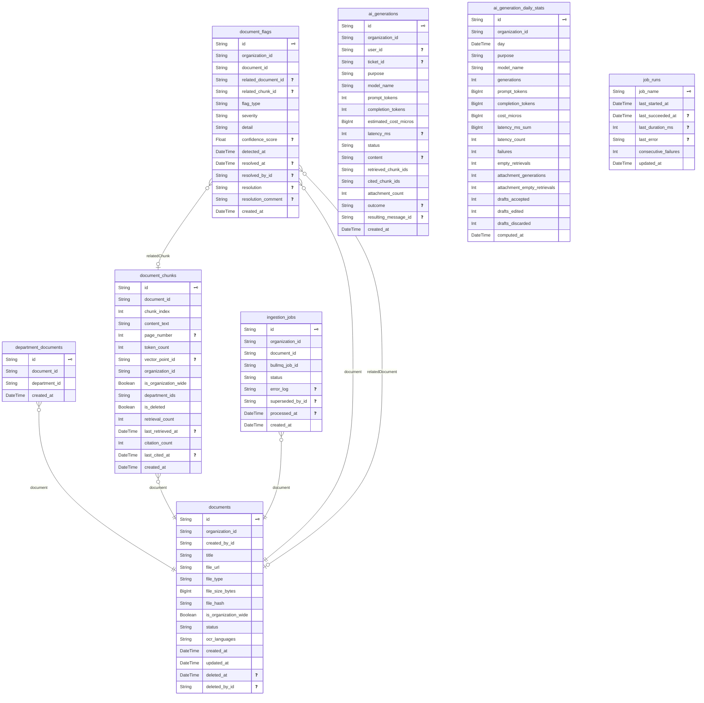

```mermaid
erDiagram

  "documents" {
    String id "🗝️"
    String organization_id 
    String created_by_id 
    String title 
    String file_url 
    String file_type 
    BigInt file_size_bytes 
    String file_hash 
    Boolean is_organization_wide 
    String status 
    String ocr_languages 
    DateTime created_at 
    DateTime updated_at 
    DateTime deleted_at "❓"
    String deleted_by_id "❓"
    }
  

  "department_documents" {
    String id "🗝️"
    String document_id 
    String department_id 
    DateTime created_at 
    }
  

  "document_chunks" {
    String id "🗝️"
    String document_id 
    Int chunk_index 
    String content_text 
    Int page_number "❓"
    Int token_count 
    String vector_point_id "❓"
    String organization_id 
    Boolean is_organization_wide 
    String department_ids 
    Boolean is_deleted 
    Int retrieval_count 
    DateTime last_retrieved_at "❓"
    Int citation_count 
    DateTime last_cited_at "❓"
    DateTime created_at 
    }
  

  "ingestion_jobs" {
    String id "🗝️"
    String organization_id 
    String document_id 
    String bullmq_job_id 
    String status 
    String error_log "❓"
    String superseded_by_id "❓"
    DateTime processed_at "❓"
    DateTime created_at 
    }
  

  "document_flags" {
    String id "🗝️"
    String organization_id 
    String document_id 
    String related_document_id "❓"
    String related_chunk_id "❓"
    String flag_type 
    String severity 
    String detail 
    Float confidence_score "❓"
    DateTime detected_at 
    DateTime resolved_at "❓"
    String resolved_by_id "❓"
    String resolution "❓"
    String resolution_comment "❓"
    DateTime created_at 
    }
  

  "ai_generations" {
    String id "🗝️"
    String organization_id 
    String user_id "❓"
    String ticket_id "❓"
    String purpose 
    String model_name 
    Int prompt_tokens 
    Int completion_tokens 
    BigInt estimated_cost_micros 
    Int latency_ms "❓"
    String status 
    String content "❓"
    String retrieved_chunk_ids 
    String cited_chunk_ids 
    Int attachment_count 
    String outcome "❓"
    String resulting_message_id "❓"
    DateTime created_at 
    }
  

  "ai_generation_daily_stats" {
    String id "🗝️"
    String organization_id 
    DateTime day 
    String purpose 
    String model_name 
    Int generations 
    BigInt prompt_tokens 
    BigInt completion_tokens 
    BigInt cost_micros 
    BigInt latency_ms_sum 
    Int latency_count 
    Int failures 
    Int empty_retrievals 
    Int attachment_generations 
    Int attachment_empty_retrievals 
    Int drafts_accepted 
    Int drafts_edited 
    Int drafts_discarded 
    DateTime computed_at 
    }
  

  "job_runs" {
    String job_name "🗝️"
    DateTime last_started_at 
    DateTime last_succeeded_at "❓"
    Int last_duration_ms "❓"
    String last_error "❓"
    Int consecutive_failures 
    DateTime updated_at 
    }
  
    "department_documents" }o--|| documents : "document"
    "document_chunks" }o--|| documents : "document"
    "ingestion_jobs" }o--|| documents : "document"
    "document_flags" }o--|| documents : "document"
    "document_flags" }o--|o documents : "relatedDocument"
    "document_flags" }o--|o document_chunks : "relatedChunk"
```
