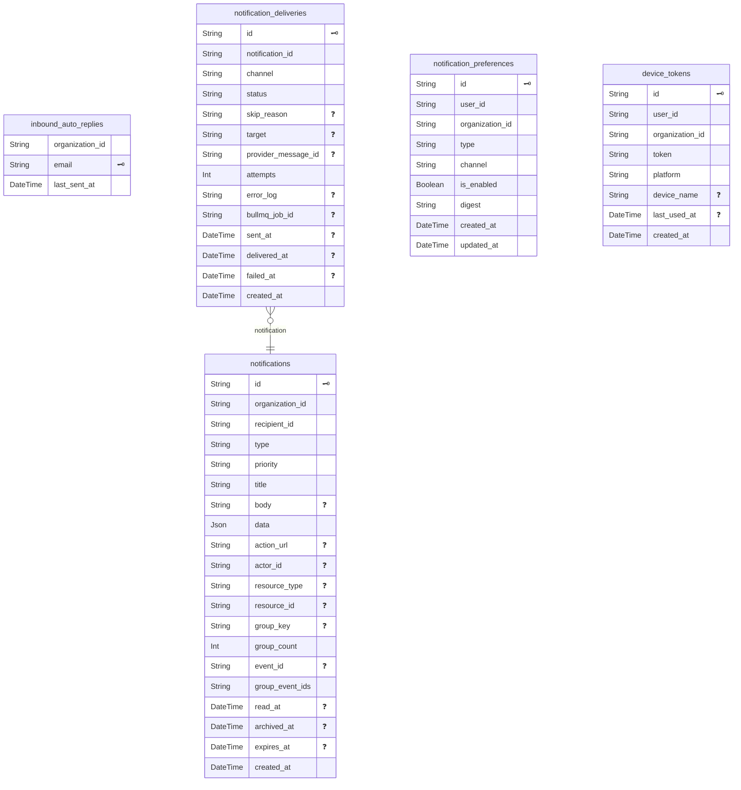

```mermaid
erDiagram

  "notifications" {
    String id "🗝️"
    String organization_id 
    String recipient_id 
    String type 
    String priority 
    String title 
    String body "❓"
    Json data 
    String action_url "❓"
    String actor_id "❓"
    String resource_type "❓"
    String resource_id "❓"
    String group_key "❓"
    Int group_count 
    String event_id "❓"
    String group_event_ids 
    DateTime read_at "❓"
    DateTime archived_at "❓"
    DateTime expires_at "❓"
    DateTime created_at 
    }
  

  "inbound_auto_replies" {
    String organization_id 
    String email "🗝️"
    DateTime last_sent_at 
    }
  

  "notification_deliveries" {
    String id "🗝️"
    String notification_id 
    String channel 
    String status 
    String skip_reason "❓"
    String target "❓"
    String provider_message_id "❓"
    Int attempts 
    String error_log "❓"
    String bullmq_job_id "❓"
    DateTime sent_at "❓"
    DateTime delivered_at "❓"
    DateTime failed_at "❓"
    DateTime created_at 
    }
  

  "notification_preferences" {
    String id "🗝️"
    String user_id 
    String organization_id 
    String type 
    String channel 
    Boolean is_enabled 
    String digest 
    DateTime created_at 
    DateTime updated_at 
    }
  

  "device_tokens" {
    String id "🗝️"
    String user_id 
    String organization_id 
    String token 
    String platform 
    String device_name "❓"
    DateTime last_used_at "❓"
    DateTime created_at 
    }
  
    "notification_deliveries" }o--|| notifications : "notification"
```
