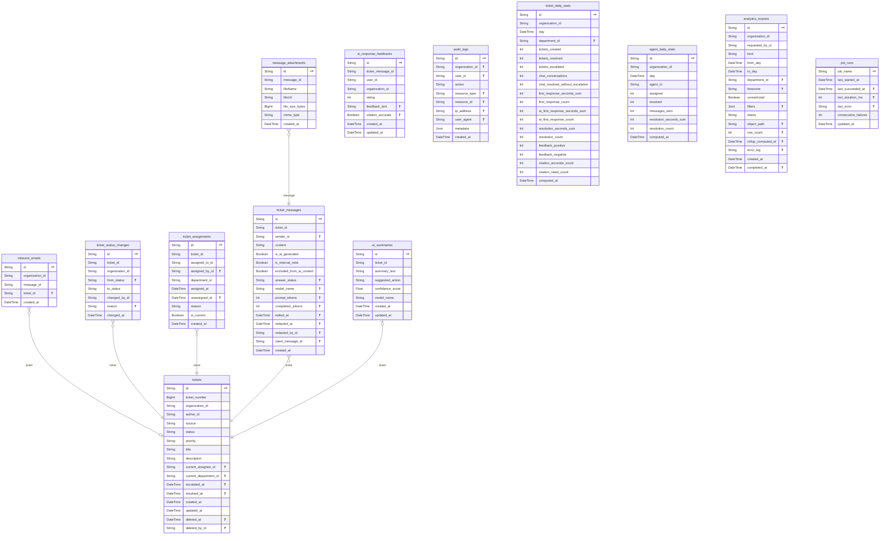

```mermaid
erDiagram

  "tickets" {
    String id "🗝️"
    BigInt ticket_number 
    String organization_id 
    String author_id 
    String source 
    String status 
    String priority 
    String title 
    String description 
    String current_assignee_id "❓"
    String current_department_id "❓"
    DateTime escalated_at "❓"
    DateTime resolved_at "❓"
    DateTime created_at 
    DateTime updated_at 
    DateTime deleted_at "❓"
    String deleted_by_id "❓"
    }
  

  "inbound_emails" {
    String id "🗝️"
    String organization_id 
    String message_id 
    String ticket_id "❓"
    DateTime created_at 
    }
  

  "ticket_status_changes" {
    String id "🗝️"
    String ticket_id 
    String organization_id 
    String from_status "❓"
    String to_status 
    String changed_by_id 
    String reason "❓"
    DateTime changed_at 
    }
  

  "ticket_assignments" {
    String id "🗝️"
    String ticket_id 
    String assigned_to_id 
    String assigned_by_id "❓"
    String department_id 
    DateTime assigned_at 
    DateTime unassigned_at "❓"
    String reason 
    Boolean is_current 
    DateTime created_at 
    }
  

  "ticket_messages" {
    String id "🗝️"
    String ticket_id 
    String sender_id "❓"
    String content 
    Boolean is_ai_generated 
    Boolean is_internal_note 
    Boolean excluded_from_ai_context 
    String answer_status "❓"
    String model_name "❓"
    Int prompt_tokens "❓"
    Int completion_tokens "❓"
    DateTime edited_at "❓"
    DateTime redacted_at "❓"
    String redacted_by_id "❓"
    String client_message_id "❓"
    DateTime created_at 
    }
  

  "message_attachments" {
    String id "🗝️"
    String message_id 
    String fileName 
    String fileUrl 
    BigInt file_size_bytes 
    String mime_type 
    DateTime created_at 
    }
  

  "ai_summaries" {
    String id "🗝️"
    String ticket_id 
    String summary_text 
    String suggested_action 
    Float confidence_score 
    String model_name 
    DateTime created_at 
    DateTime updated_at 
    }
  

  "ai_response_feedbacks" {
    String id "🗝️"
    String ticket_message_id 
    String user_id 
    String organization_id 
    Int rating 
    String feedback_text "❓"
    Boolean citation_accurate "❓"
    DateTime created_at 
    DateTime updated_at 
    }
  

  "audit_logs" {
    String id "🗝️"
    String organization_id "❓"
    String user_id "❓"
    String action 
    String resource_type "❓"
    String resource_id "❓"
    String ip_address "❓"
    String user_agent "❓"
    Json metadata 
    DateTime created_at 
    }
  

  "ticket_daily_stats" {
    String id "🗝️"
    String organization_id 
    DateTime day 
    String department_id "❓"
    Int tickets_created 
    Int tickets_resolved 
    Int tickets_escalated 
    Int chat_conversations 
    Int chat_resolved_without_escalation 
    Int first_response_seconds_sum 
    Int first_response_count 
    Int ai_first_response_seconds_sum 
    Int ai_first_response_count 
    Int resolution_seconds_sum 
    Int resolution_count 
    Int feedback_positive 
    Int feedback_negative 
    Int citation_accurate_count 
    Int citation_rated_count 
    DateTime computed_at 
    }
  

  "agent_daily_stats" {
    String id "🗝️"
    String organization_id 
    DateTime day 
    String agent_id 
    Int assigned 
    Int resolved 
    Int messages_sent 
    Int resolution_seconds_sum 
    Int resolution_count 
    DateTime computed_at 
    }
  

  "analytics_exports" {
    String id "🗝️"
    String organization_id 
    String requested_by_id 
    String kind 
    DateTime from_day 
    DateTime to_day 
    String department_id "❓"
    String timezone "❓"
    Boolean unrestricted 
    Json filters "❓"
    String status 
    String object_path "❓"
    Int row_count "❓"
    DateTime rollup_computed_at "❓"
    String error_log "❓"
    DateTime created_at 
    DateTime completed_at "❓"
    }
  

  "job_runs" {
    String job_name "🗝️"
    DateTime last_started_at 
    DateTime last_succeeded_at "❓"
    Int last_duration_ms "❓"
    String last_error "❓"
    Int consecutive_failures 
    DateTime updated_at 
    }
  
    "inbound_emails" }o--|o tickets : "ticket"
    "ticket_status_changes" }o--|| tickets : "ticket"
    "ticket_assignments" }o--|| tickets : "ticket"
    "ticket_messages" }o--|| tickets : "ticket"
    "message_attachments" }o--|| ticket_messages : "message"
    "ai_summaries" |o--|| tickets : "ticket"
```
