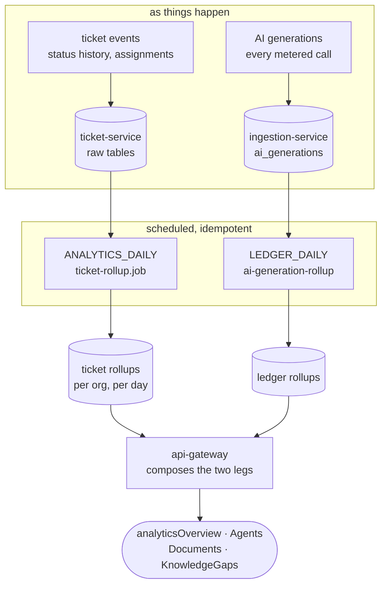

# Flow — events become numbers

**The write side of analytics.** What is recorded as things happen, which jobs
turn it into rollups, and why a dashboard's two freshness fields mean different
things.

**The read side is [`graphql-api.md`](../../graphql-api.md) §3 and §9**, which
documents the four analytics queries, the `unavailable` degradation block and
the `dataThrough` / `computedAt` semantics. This document is the half that
explains _why_ those behave as they do; the two are deliberately not written
twice.

---

## 1. The path

**Two legs, two services, two schedulers.** That is the fact everything else in
this document follows from: a dashboard figure is a composition of rollups
written by jobs that run on different cadences in different services, and either
leg can be behind.

---

## 2. Rollups are plain tables

[ADR 0009](../../decisions/0009-rollups-are-plain-tables.md): daily rollup
tables, written by an idempotent job with a backfill entry point. Not
materialized views, not queries against raw rows.

The reason that matters most operationally: **raw rows are _intended_ to be
retention-rolled.** The plan is that `ai_generations` aggregates to daily per
`(org, purpose, model)` after ~90 days, so any analytics query written against
raw rows would silently lose history the moment retention ships.

> **Retention is not built.** There is no retention job among the nine, and
> `JOB_SEQUENCES` says so in place — _"Retention belongs here, LAST, when it is
> built."_ The ~90-day figure is from the data model, not from code. The rollups
> are still the right shape; the pressure that makes them mandatory has not
> arrived yet.

Materialized views were rejected because Prisma cannot express them, they
refresh whole rather than incrementally, and a `REFRESH` over a quarter is the
same hot-path competition moved to a different hour.

**Idempotent, with a backfill.** `rollup()` takes a window and `backfill(from,
to)` takes a range, so _"recompute March"_ is an operation rather than an
incident. Re-running a day is safe by construction.

**No rows for a quiet tenant, and that is correct** — a tenant with no activity
produces no rollup row rather than a row of zeroes. Readers must treat absence
as zero rather than as an error.

---

## 3. Cadence, and why it differs

| Job               | Cron        | Steps                                                           |
| :---------------- | :---------- | :-------------------------------------------------------------- |
| `LEDGER_HOURLY`   | `0 * * * *` | `discarded-draft-sweep`, `quota-reconcile` — **not** the rollup |
| `LEDGER_DAILY`    | `0 2 * * *` | `ai-generation-rollup`                                          |
| `ANALYTICS_DAILY` | `0 2 * * *` | `ticket-rollup`                                                 |

**Both rollups run at the same time**, `0 2 * * *`, in different services. The
hourly job is housekeeping — sweeping discarded drafts and reconciling the quota
counter — and writes no rollup at all. Reading "hourly ledger" as "the spend
figures refresh hourly" is the mistake this table exists to prevent.

That also weakens the _"two legs, two cadences"_ framing: the legs are two
**services** running on one schedule, so a divergence in `dataThrough` is one of
them having failed rather than one of them being naturally behind.

All of them are BullMQ repeats with stable job ids, never `@Cron`
([ADR 0003](../../decisions/0003-bullmq-over-nest-cron.md)) — which is what makes
running three replicas safe: one schedule, not three.

---

## 4. The two freshness fields, and why they are on different types

This is the part `graphql-api.md` documents and cannot explain.

**`dataThrough` is the stalest leg's coverage, not the freshest.** A figure that
spans the ticket rollups and the ledger rollups is only as current as whichever
ran last; reporting the fresher would let a healthy job vouch for a broken one.

**`computedAt` says when the rollups ran.** It exists only on
`AnalyticsOverview` — the one analytics type with **no `unavailable` block** —
while the three that carry `unavailable` have `dataThrough` and no `computedAt`.

So the diagnostic _"compare when it ran against what it covers"_ is available on
`analyticsOverview` alone. On the other three, a stale scheduler shows up as
`dataThrough` falling behind today's date, and a _failed_ leg shows up in
`unavailable` instead.

**`unavailable` is a composition failure, not a job failure.** It means the
gateway asked two legs and one did not answer — the rollups may be perfectly
fresh and the service holding them unreachable. A dashboard that drops the block
silently is a dashboard that lies.

---

## 5. Exports

`export.processor.ts` runs export jobs off the same rollups rather
than off raw rows, so an export and a dashboard cannot disagree. It is a queue
job for the ordinary reason: a quarter's export is minutes of work that must not
run inside a request.

---

## 6. Edge cases

| Situation                                     | What happens                                        | Why that, and not an error                                                       |
| :-------------------------------------------- | :-------------------------------------------------- | :------------------------------------------------------------------------------- |
| **Quiet tenant**                              | no rollup row for that day                          | Absence is zero; writing zero rows for every tenant every day is the alternative |
| **Job missed a run**                          | the next run's window covers it, or `backfill` does | Idempotent by construction — that is what makes recovery routine                 |
| **One leg behind**                            | `dataThrough` reports the stalest                   | The healthy leg must not vouch for the broken one                                |
| **One leg unreachable**                       | `unavailable` names it; the rest is returned        | Partial figures beat no dashboard, _if_ the gap is visible                       |
| **Retention rolls the raw rows** (when built) | rollups still answer                                | This is the reason rollups exist rather than live queries — see §2               |
| **Re-running a day**                          | same result                                         | Idempotent; `backfill` is the supported entry point                              |
| **Three replicas**                            | one schedule                                        | Stable BullMQ job ids, not `@Cron`                                               |

---

## 7. When it misbehaves — where to look first

| Symptom                                       | Look at                                                                                         |
| :-------------------------------------------- | :---------------------------------------------------------------------------------------------- |
| Numbers stopped updating                      | `job_runs` for the relevant job, then `dataThrough` on the response                             |
| A dashboard shows zeroes for an active tenant | whether rollup rows exist for those days at all — absence is not zero for a _busy_ tenant       |
| Overview is fresh, agent stats are stale      | both dailies run at `0 2 * * *`, so this is one leg **failing**, not lagging — check `job_runs` |
| A block is missing entirely                   | `unavailable` — this is composition, not computation                                            |
| Export disagrees with the dashboard           | they read the same rollups; a difference means one of them is reading raw rows                  |
| Figures changed after a backfill              | expected — the backfill recomputed; check it covered the window you meant                       |

---

## 8. Related

- [`graphql-api.md`](../../graphql-api.md) — the read side: the four queries and their freshness fields
- [`ticket-lifecycle.md`](./ticket-lifecycle.md) — the status history these rollups read
- ADRs [0003](../../decisions/0003-bullmq-over-nest-cron.md),
  [0005](../../decisions/0005-meter-cost-not-tokens.md),
  [0009](../../decisions/0009-rollups-are-plain-tables.md),
  [0025](../../decisions/0025-chunk-usage-is-a-projection.md)
