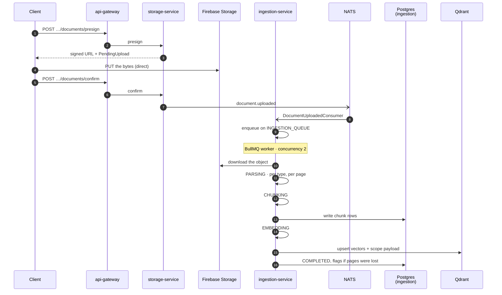
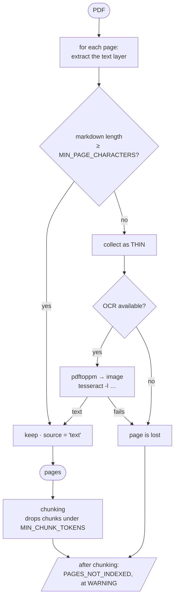

# Flow — a document becomes searchable

**One file, end to end.** A knowledge manager uploads a PDF; some minutes later
an AI answer cites page 14 of it. This document follows that path, including the
branch most files never take.

The **retrieval** side — what happens to those chunks when someone asks a
question — is [`rag-answering.md`](./rag-answering.md). This document stops the
moment the vectors are written.

---

## 1. The path



**The bytes never pass through an application server.** The client uploads
directly to Firebase against a signed URL and the gateway only ever sees the
confirmation — [ADR 0024](../../decisions/0024-one-upload-mechanism.md). That is
also why ingestion downloads the object itself rather than receiving it.

**The queue is entered from an event, not from the request.** `confirm` returns
as soon as the NATS publish succeeds; everything after that is asynchronous and
observable only through the job's status.

---

## 2. Components

| Component | Module | Owns |
| :---- | :---- | :---- |
| storage-service | the presign/confirm pair | the signed URL and the `PendingUpload` row |
| ingestion-service | `DocumentUploadedConsumer` | turning the event into a job |
| — the queue | `ingestion-queue.service.ts` | enqueue, retries, cancellation |
| — the worker | `ingestion.worker.ts` | BullMQ wiring, `concurrency: 2` |
| — the stages | `ingestion.processor.ts` | parse → chunk → embed → complete/fail |
| — parsing | `document-parser.service.ts` | one branch per MIME type |
| — OCR | `ocr.service.ts` | `pdftoppm` + `tesseract`, per page |
| — chunking | `document-chunker.service.ts` | page markdown → chunks |
| Postgres | `document_chunks` | chunk text, and the lexical index |
| Qdrant | `document_chunks` collection | vectors + the four scope fields |

---

## 3. Job status, and what each transition means

```
QUEUED → PARSING → CHUNKING → EMBEDDING → COMPLETED
                                        ↘ FAILED
                                        ↘ CANCELLED
```

`CANCELLED` is a **job** status only. A cancelled job's *document* is
`DocumentStatus.FAILED` — the two enums are not parallel and reading one for the
other is a common mistake. It means stopped on request, or superseded by a
retry.

The status is written at each stage boundary, so a stuck job says where it
stuck. A job sitting in `PARSING` for minutes is almost always OCR (§4).

---

## 4. Parsing, and the branch most files skip

Each MIME type has its own parser. The interesting one is PDF, because it is the
only type that can *silently* contain no text at all.



**"Too little", not "empty"** — the test is `>= MIN_PAGE_CHARACTERS`, not
`length > 0`. A page carrying a scanner stamp or a partial OCR layer has a
handful of characters and is still an image; the earlier emptiness test let those
through as text and produced a document that indexed to nothing useful.

**Only the thin pages are rendered.** A 200-page PDF with two scanned pages pays
for two — OCR is a per-page branch, not a per-document mode
([ADR 0016](../../decisions/0016-ocr-is-a-per-page-branch.md)).

**Language codes are narrowed once, by parsing rather than casting.** An
unrecognised code throws, producing a `FAILED` job that carries the bad code —
the alternative is the code dropping out of `-l` and the document being OCR'd in
English with nothing reporting it.

**The flag is raised after chunking, not during parsing — and that is where the
second drop is caught.** A page that OCR'd to eight tokens clears the parser's
bar (`MIN_PAGE_CHARACTERS` is 32 *characters*) and is then discarded by the
chunker (`MIN_CHUNK_TOKENS` is 16 *tokens*), so it *"survived the parser, counted
as a success, and vanished anyway."* Raising the flag at the parse step would
miss every page lost that way.

**A partly-lost document does not fail; a totally-lost one does.** Losing *some*
pages raises `PAGES_NOT_INDEXED` at `WARNING` (not the `INFO` default) carrying
page numbers and counts — never document text — and the rest is indexed and
searchable.

Losing *all* of them is `NoExtractableText`, which is an error: the job is
`FAILED` rather than `COMPLETED`-with-a-flag. The distinction is what the reader
can do about it — a document with nine of ten pages is usable and worth
searching; a document with none of them is a scan the pipeline could not read,
and reporting that as success would leave a knowledge manager believing it was
indexed.

`OcrUnavailable` is separate again, decided by the binaries being missing rather
than by the text being absent, *"because the reader is different"* — one is
"re-upload this", the other is "fix this deployment".

---

## 5. Chunking and the spend ceiling

`MAX_CHUNKS_PER_DOCUMENT` is checked **after chunking and before any embedding
call**. The ceiling exists to stop the spend, so checking it after paying would
be checking nothing.

Chunk rows are written to Postgres before embedding, which is what makes the
lexical arm of retrieval work even if the vector upsert later fails: the text is
searchable, the vectors are not, and the document is not silently absent from
both.

---

## 6. Embedding and the scope payload

Each chunk is embedded and upserted to Qdrant with a payload carrying the four
fields the retrieval boundary compares — `organization_id`, `is_deleted`,
`is_organization_wide`, `department_ids`. Those are duplicated into
`document_chunks` in Postgres deliberately, so both retrieval arms compare the
same four fields rather than one reading a payload and the other joining three
tables. `rag-answering.md` §5 is why that matters.

**Scope is not static.** Moving a document between departments changes those
payloads for every chunk, which is the `SCOPE_FANOUT_QUEUE` path
(`scope-writer.service.ts`, `scope-fanout.processor.ts`) and
[ADR 0036](../../decisions/0036-scope-fanout-order-is-asymmetric.md) — restrictions
are applied synchronously, widenings asynchronously.

---

## 7. Edge cases

| Situation | What happens | Why that, and not an error |
| :---- | :---- | :---- |
| **PDF is entirely scanned** | every page is thin; OCR runs on all of them | The document is still indexable — slowly |
| **No page yields any text** | `NoExtractableText` → job `FAILED` | Not a flag: a document with nothing in it was not indexed, and saying otherwise misleads |
| **OCR binaries absent** | warns once at boot **and logs at `error` per document** | The run-open rule: text documents still work. The per-document line is deliberate — the boot warning *"is one line in a stream nobody re-reads, and by the time tenants are failing it has scrolled away"* |
| **Some pages lost** | `PAGES_NOT_INDEXED`, document `COMPLETED` | A partly-indexed document beats no document; the flag is what tells the manager to re-upload |
| **Chunk count over ceiling** | `FAILED`, before any embedding spend | The check is placed to prevent cost, not to report it |
| **Unrecognised OCR language** | `FAILED`, carrying the code | Better than OCR'ing in the wrong language and reporting success |
| **Object missing from storage** | `FAILED` at download | Nothing to parse; the `PendingUpload` record is how this is diagnosed |
| **`.doc` uploaded** | not parsed | A real `.doc` is an OLE compound file, not a zip; the parser fails with a bare error that costs three retries |
| **Job retried** | previous job → `CANCELLED`, document → `FAILED` until the new one completes | A retry supersedes; two live jobs on one document is the state to avoid |
| **Worker killed mid-job** | BullMQ redelivers; `INGESTION_RECONCILE` catches orphans | Redelivery is the queue's job; the sweep is for what the queue lost |

---

## 8. The memory bound

`MAX_DOCUMENT_BYTES` is 100 MB and the worker runs at `concurrency: 2`, so two
raw buffers can be resident at the peak. **Those buffers live outside the V8
heap**, so the `--max-old-space-size` in the image bounds the extracted text and
the chunk arrays and does *not* bound them — only the container memory limit
does. Both are set together in `k8s/services/ingestion-service.yaml`; changing
one without the other is how this becomes an OOMKill.

The OCR path adds a second bound: `pdftoppm` rasterises each page to a temp file
before `tesseract` reads it, so scanned pages land on the container filesystem
rather than in memory. That is what `ephemeral-storage` is sized for.

---

## 9. When it misbehaves — where to look first

| Symptom | Look at |
| :---- | :---- |
| Job stuck in `PARSING` | OCR — a scanned document renders every thin page in sequence |
| Job `FAILED` on a scan that looks fine | `NoExtractableText` vs `OcrUnavailable` — the first is the file, the second is the deployment |
| Document `COMPLETED` but nothing is found | the Qdrant upsert, then the scope payload — chunk rows can exist without vectors |
| Answers cite an old version of a document | `SCOPE_FANOUT_QUEUE`, and whether the change was a widening (async) or a restriction (sync) |
| A whole tenant's documents stop indexing | the queue depth first, then the ledger — embedding is metered |
| `PAGES_NOT_INDEXED` on a document that looks fine | **two bars, not one** — the page may have cleared `MIN_PAGE_CHARACTERS` (32 chars) at parse and then failed `MIN_CHUNK_TOKENS` (16 tokens) at chunking |
| Worker restarts under load | the container memory limit, not the heap flag (§8) |

---

## 10. Related

- [`rag-answering.md`](./rag-answering.md) — what these chunks are for
- [`sys-flows.md` §1](../sys-flows.md) — the ownership map: which service owns which table
- ADRs [0016](../../decisions/0016-ocr-is-a-per-page-branch.md),
  [0017](../../decisions/0017-attachments-reach-retrieval.md),
  [0024](../../decisions/0024-one-upload-mechanism.md),
  [0035](../../decisions/0035-ocr-language-cap-is-a-cpu-bound.md),
  [0036](../../decisions/0036-scope-fanout-order-is-asymmetric.md)
