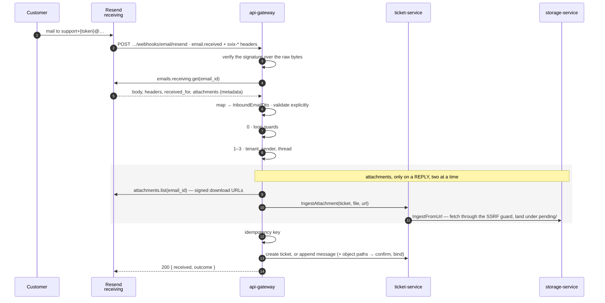

# Flow — a customer emails support

**One mail, from the MX record to a ticket.** This is the only flow that begins outside the cluster: Resend receives the mail, and the gateway learns of it through a signed webhook that carries an id rather than the mail itself.

Where it ends — a ticket created or a message threaded — is [`ticket-lifecycle.md`](./ticket-lifecycle.md).

---

## 1. The path

**The webhook is a notification, not the mail.** Resend's `email.received` event carries the mail's id and envelope; the body and headers come from a second call the gateway makes with its own key. So the signature protects a small, fixed-shape payload, and the sender-controlled bytes are only ever read from Resend's API — never from the request that woke the handler.

**No application server that takes internet input ever holds an attachment's bytes.** The gateway carries a signed URL; ticket-service authorises the write; storage-service — the one process built for bytes — fetches the file and lands it exactly where a client's presigned upload lands (§7). Anything refused along the way is named in the ticket's note.

---

## 2. Components

| Component | Where | Owns |
| :--- | :--- | :--- |
| Resend receiving | the `INBOUND_EMAIL_DOMAIN` | MX record, the mailbox, the `email.received` webhook and its retries |
| gateway — the webhook | `resend-inbound.service.ts` | signature, the fetch, the explicit validation, the counter |
| gateway — the mapper | `resend-inbound.mapper.ts` | Resend's two objects → one `InboundEmailDto`; the three-way attachment split |
| gateway — routing | `inbound-email.service.ts` | tenant, sender, thread, idempotency; which attachments are eligible, and the note |
| gateway — loop guards | same, step 0 | refusing mail that would loop |
| ticket-service | create/append; `IngestAttachment` | the ticket, the message, the thread; authorising a write under a ticket's prefix |
| storage-service | `IngestFromUrl`, `remote-source.fetcher.ts` | fetching the bytes through the SSRF guard and landing them under `pending/` |
| `libs/common` | `guarded-target.ts` | the one SSRF control, shared with outbound webhooks |
| `provision-resend.mjs` | `scripts/` | creating the webhook; reading its signing secret back |
| `resend-preflight.mjs` | `scripts/` | reading what a real account returns — headers, `received_for`, download hosts, expiry — without printing values |

**The route is not per-address.** The tenant lives in the local part — `support+{inbound_token}@…` — so every tenant shares one receiving domain ([ADR 0018](../../decisions/0018-inbound-email-routing-and-threading.md)). A tenant with a `NULL` `organizations.inbound_token` receives no mail, and that is the default: enabling a tenant is setting that column.

**The recipient is the envelope, not the `To:` header.** The mapper picks the first `received_for` entry on the inbound domain, so a mail that reached the tenant address by BCC or through a list still routes where the header would name somebody else. More than one tenant address on one mail routes by the first and logs the count.

---

## 3. Three secrets, two of them per direction

| Secret | Held by | What it is for |
| :--- | :--- | :--- |
| `RESEND_WEBHOOK_SECRET` | gateway | verifying that a webhook came from Resend |
| `RESEND_GATEWAY_API_KEY` | gateway | fetching an inbound mail's body — a **different** key from the sending one |
| `INBOUND_EMAIL_SECRET` | gateway **and** notification-service | minting the reply token in `Reply-To`, and parsing it back out |

The first two fail loudly: a wrong webhook secret is **401 on every delivery**, counted (§6); a wrongly scoped gateway key drops every mail with `fetch_failed` in the same counter.

**The third is the one to fear.** `INBOUND_EMAIL_SECRET` is one value in two services, and a mismatch is silent: `parseTicketReplyToken` returns `null` and the caller **opens a new ticket** — correctly, deliberately, with nothing in a log — and it presents weeks later as _"threading stopped working"_. Rotate both at once; a partial rotation is worse than a wrong one, because half of it keeps working.

The sending key and the receiving key are separate by name and by scope on purpose: a leaked `RESEND_GATEWAY_API_KEY` must not be able to send, and rotating `RESEND_API_KEY` must not stop inbound.

---

## 4. Signing

**Verify the exact bytes, then trust nothing else about the request.** Resend signs with the Standard Webhooks scheme: `svix-id`, `svix-timestamp` and `svix-signature` over `${id}.${timestamp}.${rawBody}`. The gateway hands the SDK the raw body Nest kept (`rawBody: true`), never a re-serialised object — key order, whitespace and number formatting are all free to differ between two `JSON.stringify` calls on structurally equal objects, and a signature over the wrong one verifies locally and fails in production.

A missing header is the same 401 as a bad signature. `verify()` throws rather than returning an error, and nothing from a rejected body is logged: an unauthenticated caller wrote every byte of it.

The e2e suites sign with their own implementation of the scheme (`standard-webhooks.ts` under `test/utils`) rather than the SDK's verifier, so a test cannot pass by the verifier agreeing with itself.

---

## 5. Loop guards, before anything else

Step 0 in the routing service, unconditionally, before tenant resolution:

- **Self-addressed mail is dropped silently** — not even a rejection event. Replying to ourselves _is_ the loop.
- **`Auto-Submitted` and `Precedence`** are the headers a machine sets; `bulk`, `list` and `junk` are refused.

The mapper forwards **only those two headers** into the DTO — a full copy is unbounded sender-controlled data with one use. Whether Resend exposes them on every mail is the open pre-flight in [plan 75](../../archive/implementations/75-resend-email.md) §8: if it does not, the guards see nothing. `node scripts/resend-preflight.mjs --inbound` lists the header **names** on the newest received mail, which is the measurement that closes it.

A mail loop is the classic way an email integration takes out a mailbox, and its blast radius is somebody else's. That is why the guards run before the work rather than after the routing.

---

## 6. Idempotency, and the retry rule

Resend redelivers any non-2xx for about seventeen hours on a growing backoff, so the gateway must be safe to call twice with the same mail. The key is the mail's own `Message-ID` — Resend's `message_id` field, stable across its retries — and the constraint is `(organization_id, message_id)`.

**It is a UNIQUE constraint, not a check-then-insert.** The same reasoning as [ADR 0026](../../decisions/0026-stripe-webhook-idempotency.md) for Stripe: two concurrent retries both pass a `findFirst` and both insert.

### 200 after verification, unless a retry can help

A drop is a decision, not a failure, and answering it with a non-2xx would turn one misconfigured mail rule into seventeen hours of redelivery. So a verified event answers 200 whenever the system has decided about it — an unknown tenant, a refused sender, a mail that fails the DTO's constraints, a fetch that fails for a reason a retry will not change. The one 503 is a **retryable** fetch failure: 429, 5xx or a network error, classified by status code in `resend-errors.ts`, the same rule the outbound side uses.

**The record is a counter, not a log.** Every exit of `resend-inbound.service.ts` increments `inbound_email_webhook_total{outcome}` exactly once:

| `outcome` | HTTP | Means |
| :--- | :--- | :--- |
| `no_raw_body` | 401 | `rawBody: true` missing from the gateway's `NestFactory` — our misconfiguration |
| `rejected_signature` | 401 | a missing `svix-*` header or a signature that does not verify — the secret is wrong |
| `ignored_event` | 200 | a verified event that is not `email.received` |
| `fetch_failed` | 200 or 503 | the body could not be fetched — 503 when a retry can fix it, 200 when it cannot |
| `invalid_payload` | 200 | the mapped mail failed the DTO's constraints |
| every `InboundOutcome` | 200 | `accept()` ran — `TICKET_CREATED`, `DUPLICATE`, `SENDER_NOT_PERMITTED`, … |

**Two questions are invisible in a single rejection count**, which is why one metric carries a label: `rejected_signature` at zero is what a healthy system and a Resend that has stopped calling have in common. `TICKET_CREATED` and `MESSAGE_APPENDED` at zero for hours means nothing is arriving — the MX record, the webhook's URL, or the receiving domain.

**Development scrapes it; production does not yet.** `docker-compose.yml` carries a Prometheus behind the `observability` profile; `k8s/` deliberately has none (`k8s/README.md`, _What is deliberately not here_). Until a collector exists there, a wrong secret pages nobody and is visible by reading `/metrics` on 9464.

---

## 7. Attachments, and the note

**Ingest is presign with the PUT done by storage-service.** `IngestFromUrl` runs the presign preamble, writes the `PendingUpload` record, fetches the bytes, and lands them under `pending/` — so `createMessage` confirms and binds the path exactly as it would a client's upload, and cannot tell who wrote it ([ADR 0024](../../decisions/0024-one-upload-mechanism.md), [ADR 0046](../../decisions/0046-resend-for-both-directions.md)).

**The mapper splits Resend's list three ways.** A `content_type` on the attachment allowlist goes to `remoteAttachments` — without a URL yet. Everything else is named in `droppedAttachments`: a type off the list, an inline image with a `content_id` (it is already in the HTML), an empty file, a name over 255 characters (truncated with `…` in the note), and anything past the twentieth. A nameless file is `(unnamed)`.

**Only a reply ingests, and only after routing.** A mail that opens a ticket has no message to attach to, so every eligible file is named as dropped. For a reply, the gateway fetches the signed URLs once — `attachments.list` at the SDK's maximum page of 100; anything past it is named — and then, per file and in order: the per-message ceiling by count (the sixth is named, the message is not lost), the tenant's per-file ceiling on Resend's claimed size, a usable unexpired URL, then `IngestAttachment` on ticket-service, **two at a time**. A slot is taken when a file is queued, not when its ingest succeeds. One refused file is logged and named and never fails the batch or the mail.

**ticket-service authorises; storage-service fetches.** `IngestAttachment` loads the ticket first (that is what authorises a write under its prefix), refuses a claimed size over the tenant's limit, and hands that limit on so the stream is cut at the number the claim was judged against. `IngestFromUrl` judges the URL before any I/O (`https:` only, no private literal), writes the record **before** the fetch, opens the source through the guarded lookup with redirects followed at most twice and re-judged per hop, sniffs the head against the declared type when 4 KB have arrived or the body has ended — a mismatch writes nothing — and streams the rest, counted, cut one byte past the ceiling. Every failure after the record consumes it and deletes any partial object.

**Three deadlines, nested**, so an inner hop fails cleanly before an outer one gives up on it and a timeout never leaves a confirmable orphan: the fetch's idle timeout (20 s) < ticket-service's deadline on storage (30 s) < the gateway's deadline on ticket-service (35 s). The per-mail worst case is `ceil(n / 2) × 35 s`, which is what Resend's webhook timeout (plan 76's P8, unmeasured) has to exceed.

**The note is applied once, for both paths** — creation and reply — from one list: the mapper's drops plus the ingest's. An emailed _reply_ carrying attachments must say in the thread what was left out, because a partial delivery with no record of the missing half is worse than a total one.

---

## 8. Edge cases

| Situation | What happens | Why that, and not an error |
| :--- | :--- | :--- |
| **Mail to a tenant with `NULL` token** | not routable; no ticket | Receiving no mail is the safe default for an unconfigured tenant |
| **Tenant address only in BCC** | still routed — `received_for` is the envelope | The header names who the sender wrote to, not where the mail went |
| **Self-addressed mail** | dropped, silently | Any reply would be the next iteration of the loop |
| **`Auto-Submitted: auto-replied`** | refused | Vacation responders are how loops start |
| **Duplicate delivery** | second insert hits the unique constraint | Resend retries; the database is the arbiter, not a prior read |
| **Wrong webhook secret** | 401, counted as `rejected_signature`; Resend retries, then gives up | No number of retries fixes a wrong secret, and the counter is the durable record |
| **Wrongly scoped gateway key** | 200, `fetch_failed` on every mail | The error is identical on every retry; the label is the alarm |
| **Resend's API 429 / 5xx on the fetch** | 503 → Resend retries | Dedup makes the retry safe |
| **`From` carries a display name** | split into `from` and `fromName` | The DTO's `@IsEmail()` refuses `Name <addr>` |
| **Mail fails the DTO's constraints** | 200, `invalid_payload`, constraint names logged — never values | A 500 would buy seventeen hours of retries for a mail that can never pass |
| **Attachments on a reply** | eligible files fetched by storage-service and bound to the message; the rest named in the note | The mail matters more than its attachments, and a partial delivery must say what is missing |
| **Attachments on a ticket-opening mail** | every file named in the note, none stored | `createTicket` writes no message, so there is nothing to attach to |
| **A file's bytes are not its declared type** | refused before a byte is written; named | The same check `confirmUpload` runs on a client upload, moved ahead of the write |
| **A source redirects into private space** | refused at that hop; named | Every hop is re-judged by the same guard as an outbound webhook target |
| **A fetch outlasts its deadline** | refused, record consumed, partial object deleted; named | The deadlines nest so the timeout cannot leave a confirmable orphan |
| **Reply whose token is unparseable** | opens a **new ticket** | §3 — this is the silent failure to watch |

---

## 9. When it misbehaves — where to look first

| Symptom | Look at |
| :--- | :--- |
| No mail arrives at all | `inbound_email_webhook_total` — no `TICKET_CREATED` for hours means Resend is not calling: MX record, the webhook's URL (`npm run resend:provision` reports it), the receiving domain. Then `inbound_token` on the tenant |
| Every delivery 401s | `RESEND_WEBHOOK_SECRET` against what `npm run resend:provision -- --print-secret` reads back. Mail is retried for hours, then dropped — no page, because nothing scrapes the counter in production yet (§6) |
| Every delivery is `fetch_failed` | `RESEND_GATEWAY_API_KEY` — its scope, or whether it is set at all |
| Replies open new tickets instead of threading | `INBOUND_EMAIL_SECRET` in **both** services (§3) |
| One mail became two tickets | the idempotency key — was a `message_id` present on that mail? |
| Attachments missing with no note | the note path — one list, the mapper's drops plus the ingest's, applied on both branches |
| Every attachment is refused with the mail still delivered | storage-service's log names the cause per file: the guard (a private hop), a type mismatch, the ceiling, a source status; then `k8s/policy/storage-egress.yaml`'s `REPLACE_ME` block if Redis is unreachable |
| A loop is filling a mailbox | step 0's guards; whether `auto-submitted` / `precedence` reached the DTO (§5); whether the sending address is self-addressed |

---

## 10. Deploying it

1. A Resend receiving domain: `.resend.app` in development; in production a subdomain with one MX record, and **the MX record goes last** — everything before it is testable from a recorded payload, while pointing a live MX record at an unfinished endpoint means debugging business logic through a mail transport, where every iteration is an email you send yourself and wait for.
2. `RESEND_PROVISION_KEY` (full access — webhooks are not a sending endpoint) and `RESEND_WEBHOOK_URL` (the public gateway origin plus `/api/v1/webhooks/email/resend`) in the root `.env`; `npm run resend:provision` to see what would happen, `-- --apply` to create the webhook. It prints the signing secret on create and reads it back on request; it is never once-only.
3. `RESEND_WEBHOOK_SECRET`, `RESEND_GATEWAY_API_KEY` and `INBOUND_EMAIL_DOMAIN` in the gateway's `.env`; `INBOUND_EMAIL_SECRET` in the gateway's and notification-service's, byte-identical.

The route needs nothing special from the Ingress: `POST /api/v1/webhooks/email/resend` sits under the ordinary prefix, authenticates with the signature rather than a JWT, and carries `@SkipThrottle()` — a retry burst is Resend doing its job; throttling it drops mail.

Storage-service's egress is constrained by `k8s/policy/storage-egress.yaml`, notification's twin: private space refused at the kernel behind the guard, with a `REPLACE_ME` CIDR for the managed Redis that **must be filled before the first apply** — unfilled, the API server refuses the policy and the deploy stops there (`k8s/README.md`).

---

## 11. Related

- [`ticket-lifecycle.md`](./ticket-lifecycle.md) — where the mail ends up
- [`notification-delivery.md`](./notification-delivery.md) — the reply tokens, minted; the outbound half of Resend
- ADRs [0018](../../decisions/0018-inbound-email-routing-and-threading.md), [0024](../../decisions/0024-one-upload-mechanism.md), [0026](../../decisions/0026-stripe-webhook-idempotency.md), [0046](../../decisions/0046-resend-for-both-directions.md)
