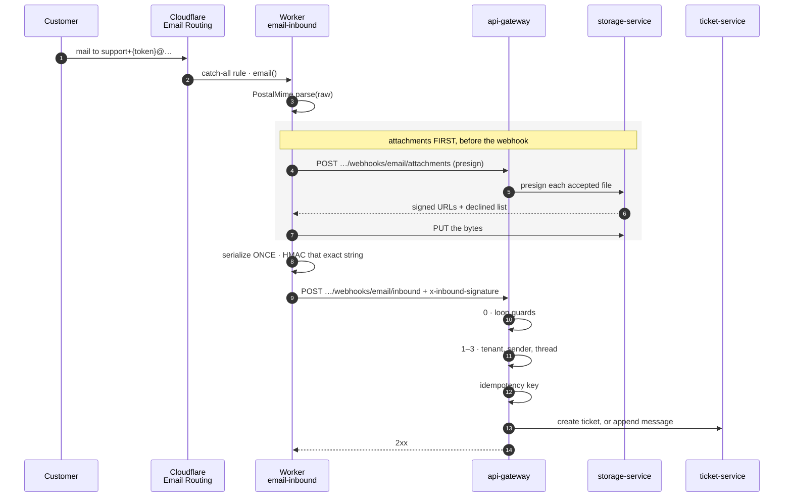

# Flow — a customer emails support

**One mail, from the MX record to a ticket.** This is the only flow that begins outside the cluster, in a Cloudflare Worker with its own runtime, its own deploy path and its own copy of a shared secret.

Where it ends — a ticket created or a message threaded — is [`ticket-lifecycle.md`](./ticket-lifecycle.md).

---

## 1. The path

**Attachments are stored before the webhook fires**, so the mail arrives at the gateway already knowing which files landed and which were declined. The alternative — webhook first, files later — makes the ticket exist for a while without its attachments and gives the reply no way to name what was dropped.

---

## 2. Components

| Component                | Where                        | Owns                                               |
| :----------------------- | :--------------------------- | :------------------------------------------------- |
| Cloudflare Email Routing | the zone                     | MX and SPF records, the catch-all rule             |
| Worker                   | `workers/email-inbound`      | parse, attachment upload, signing, retry behaviour |
| gateway — signature      | `inbound-signature.guard.ts` | authenticating the Worker                          |
| gateway — routing        | `inbound-email.service.ts`   | tenant, sender, thread, idempotency                |
| gateway — loop guards    | same, step 0                 | refusing mail that would loop                      |
| storage-service          | presign                      | the signed URLs the Worker uploads against         |
| ticket-service           | create/append                | the ticket, the message, the thread                |

**The catch-all rule is not per-address.** The tenant lives in the local part — `support+{inbound_token}@…` — so every tenant shares one route ([ADR 0018](../../decisions/0018-inbound-email-routing-and-threading.md)). A tenant with a `NULL` `organizations.inbound_token` receives no mail, and that is the default: enabling a tenant is setting that column.

---

## 3. The shared secret has three holders

`INBOUND_EMAIL_SECRET` is one value in three deployment surfaces, and the two
agreements fail in **opposite** directions:

| Pair                                          | Failure when they disagree                                                            |
| :-------------------------------------------- | :------------------------------------------------------------------------------------ |
| Worker → gateway (`INBOUND_SECRET`)           | **401 on every message**, each one dropped and counted, never retried (§6)            |
| notification-service → gateway (reply tokens) | `parseTicketReplyToken` returns `null` and the caller **opens a new ticket** — silent |

The second is the one to fear. Every customer reply starts a fresh ticket, correctly, deliberately, with nothing in a log — and it presents weeks later as _"threading stopped working"_. Rotating the secret means rotating all three at once; a partial rotation is worse than a wrong one, because two thirds of it keeps working.

---

## 4. Signing

**Serialize once, sign that string, send that string.** The Worker builds the JSON body a single time and HMACs exactly the bytes it will transmit. Signing a re-serialized object is how a signature verifies locally and fails in production: key order, whitespace and number formatting are all free to differ between two `JSON.stringify` calls on structurally equal objects.

---

## 5. Loop guards, before anything else

Step 0 in the service, unconditionally, before tenant resolution:

- **Self-addressed mail is dropped silently** — not even a rejection event. Replying to ourselves _is_ the loop.
- **`Auto-Submitted` and `Precedence`** are the headers a machine sets; `bulk`, `list` and `junk` are refused.

A mail loop is the classic way an email integration takes out a mailbox, and its blast radius is somebody else's. That is why the guards run before the work rather than after the routing.

---

## 6. Idempotency, and the retry rule

Cloudflare retries on any thrown error, so the gateway must be safe to call twice with the same mail. The key is the message's own `Message-ID` — which the Worker forwards along with the message `Date` for exactly this purpose — and the constraint is `(organization_id, message_id)`.

**It is a UNIQUE constraint, not a check-then-insert.** The same reasoning as [ADR 0026](../../decisions/0026-stripe-webhook-idempotency.md) for Stripe: two concurrent retries both pass a `findFirst` and both insert.

### The 401 does not retry, and the record is on the gateway

**A 401 returns; every other non-2xx throws.** An uncaught throw out of `email()` is what makes Cloudflare retry, and retrying a wrong `INBOUND_SECRET` is a storm rather than a recovery — no number of attempts fixes a secret. A 5xx still throws, because a transient gateway failure _is_ worth retrying and the `(organization_id, message_id)` constraint above is what makes that safe.

This honours a decision the gateway had already made and the Worker used to override: `InboundSignatureGuard` answers _"401, not 400 and never 5xx. A 5xx tells the provider to retry"_.

**The cost is that the message is dropped** — accepted by Cloudflare, never delivered. That is the deliberate half: a dropped message with a counted rejection beats an unbounded retry of one that can never be accepted.

**The durable record is a gateway counter, not a Worker log.** This Worker has no `observability` block, no tail consumer and no logpush; its one `console.error` is visible in a live `wrangler tail` and nowhere else. What an operator can read afterwards is `inbound_email_webhook_total`, incremented at all three of `InboundSignatureGuard`'s exits:

| Series                    | Answers                                                                         |
| :------------------------ | :------------------------------------------------------------------------------ |
| `rejected_signature` > 0  | the shared secret is wrong — certain, permanent, blocks all mail                |
| `accepted` == 0 for hours | the Worker is **not calling at all** — MX record, routing rule, deploy          |
| `no_raw_body` > 0         | `rawBody: true` missing from the gateway's `NestFactory` — our misconfiguration |

**The second question is invisible in the first**, which is why one metric carries a label rather than a single rejection counter: a `rejected_signature` count of zero is what a healthy system and a dead Worker have in common.

**Nothing scrapes it yet.** `docker/prometheus/` holds alert rules and there is no Prometheus in `docker-compose.yml` or in `k8s/`. The counter is retained and unread until a collector exists — strictly better than the Worker's nothing, and **not an alert**. Until then a wrong secret pages nobody; it is visible by reading `/metrics` on 9464.

---

## 7. Attachments, and the note

The Worker presigns against the _resolved ticket_ before the webhook runs, using **the same routing resolver the webhook uses**. If the two could disagree, a customer's screenshot would upload under one ticket's prefix and attach to another's message.

Storing an attachment is **never fatal**. A mail whose files cannot be stored is still a mail worth delivering, so the Worker records what was dropped and carries the list forward.

**The note is applied once, for both paths** — creation and reply. It was previously reached only on ticket creation, so an emailed _reply_ carrying attachments dropped them in silence: no file, no note, nothing in the thread saying anything had been left out. Survivable while mail dropped every attachment; not survivable once some land and some do not, because a partial delivery with no record of the missing half is worse than a total one.

---

## 8. Edge cases

| Situation                              | What happens                                                                  | Why that, and not an error                                                                    |
| :------------------------------------- | :---------------------------------------------------------------------------- | :-------------------------------------------------------------------------------------------- |
| **Mail to a tenant with `NULL` token** | not routable; no ticket                                                       | Receiving no mail is the safe default for an unconfigured tenant                              |
| **Self-addressed mail**                | dropped, silently                                                             | Any reply would be the next iteration of the loop                                             |
| **`Auto-Submitted: auto-replied`**     | refused                                                                       | Vacation responders are how loops start                                                       |
| **Duplicate delivery**                 | second insert hits the unique constraint                                      | Cloudflare retries; the database is the arbiter, not a prior read                             |
| **Wrong shared secret**                | 401; the message is **dropped, not retried**, and counted on the gateway (§6) | No number of retries fixes a wrong secret; a 5xx still retries, because that one is transient |
| **Gateway 5xx**                        | Worker throws → Cloudflare retries                                            | Dedup makes the retry safe                                                                    |
| **Attachment upload fails**            | mail still delivered, files named in the note                                 | The mail matters more than its attachments                                                    |
| **Attachment type declined**           | same — named in the note                                                      | The customer learns what was ignored                                                          |
| **Reply whose token is unparseable**   | opens a **new ticket**                                                        | §3 — this is the silent failure to watch                                                      |

---

## 9. When it misbehaves — where to look first

| Symptom                                       | Look at                                                                                                                                                                   |
| :-------------------------------------------- | :------------------------------------------------------------------------------------------------------------------------------------------------------------------------ |
| No mail arrives at all                        | `inbound_email_webhook_total{outcome="accepted"}` — zero for hours means the Worker is not calling: MX record, catch-all rule, deploy. Then `inbound_token` on the tenant |
| Every message 401s                            | the secret's three holders (§3). Mail is **dropped** while it is wrong — no storm, and no page either, because nothing scrapes the counter yet (§6)                       |
| Replies open new tickets instead of threading | the **third** holder: notification-service's reply-token minter (§3)                                                                                                      |
| One mail became two tickets                   | the idempotency key — was a `Message-ID` present on that mail?                                                                                                            |
| Attachments missing with no note              | the note path — it must be applied on the reply path too                                                                                                                  |
| A loop is filling a mailbox                   | step 0's guards, and whether the sending address is self-addressed                                                                                                        |

---

## 10. Deploying it

The Worker's own `README.md` carries the ordered sequence, and **the MX record goes last** deliberately: everything before it is testable from a recorded payload, while pointing a live MX record at an unfinished endpoint means debugging business logic through a mail transport, where every iteration is an email you send yourself and wait for.

The Worker is outside turbo's build and lint by design — it is a Workers runtime, not a Nest app — so its only automated check is `npm run typecheck` inside its directory, plus its fixture contract test.

---

## 11. Related

- [`ticket-lifecycle.md`](./ticket-lifecycle.md) — where the mail ends up
- [`notification-delivery.md`](./notification-delivery.md) — the reply tokens, minted
- ADRs [0018](../../decisions/0018-inbound-email-routing-and-threading.md), [0024](../../decisions/0024-one-upload-mechanism.md), [0026](../../decisions/0026-stripe-webhook-idempotency.md)
