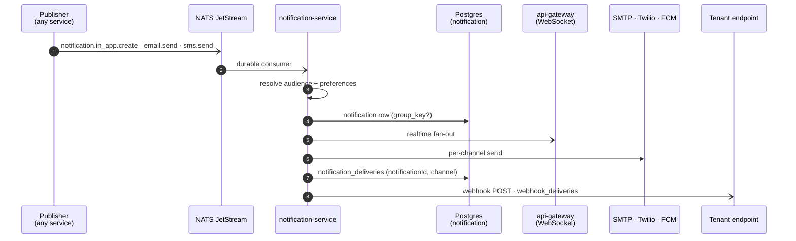

# Flow — one event becomes five kinds of message

**One thing happened; who hears about it, how, and where that is recorded.** A ticket was escalated, a quota crossed 80%, an invitation was sent — this document follows the path from the publish to the person's phone.

What *produces* the events is elsewhere: [`ticket-lifecycle.md`](./ticket-lifecycle.md) publishes most of them. This document starts at the subject.

---

## 1. The path

**The subjects are durable**, which is the distinction [ADR 0041](../../decisions/0041-durable-subjects-are-the-ones-with-nothing-to-reconcile-against.md) draws: `notification.in_app.create`, `notification.email.send`, `notification.sms.send` and `audit.record` are durable because a lost one cannot be reconstructed from state. `ticket.assigned` is core NATS — if it is lost, the assignment row still says who owns the ticket.

---

## 2. Five channels, and one of them is not a user channel

| Channel | Destination | Recorded in |
| :---- | :---- | :---- |
| `IN_APP` | a row plus a WebSocket frame | `notification_deliveries` |
| `EMAIL` | SMTP | `notification_deliveries` |
| `SMS` | Twilio | `notification_deliveries` |
| `PUSH` | FCM, one row **per person** | `notification_deliveries` |
| `WEBHOOK` | a tenant-registered endpoint | **`webhook_deliveries`** |

**`WEBHOOK` is deliberately not in `PREFERENCE_CHANNELS`.** The destination belongs to the *organization*, not to a person, so a user preference has nothing to say about it — and it writes a different table, because `notification_deliveries` answers *"did we tell this person"* and a webhook does not tell a person anything.

**`PUSH` is one delivery row per person, not per device**, and that is the design rather than a limit to work around. `notification_deliveries` is unique on `(notificationId, channel)`, and *"did we tell this person, and if not why"* has one answer however many phones they own. Per-device outcome lives on `device_tokens` — the row that actually gets deleted.

---

## 3. Grouping is scoped to unread

The collapse index is **partial**: `WHERE read_at IS NULL AND group_key IS NOT NULL` ([ADR 0019](../../decisions/0019-notification-grouping-is-unread-scoped.md)).

Once a user has read *"3 new replies"*, the next reply is new information and starts a fresh row. Without the unread scope, a long thread produces one notification the user read on day one and never sees again.

This is why `unreadNotificationCount` is a first-class query rather than a `length` over a page — the count is the thing the badge needs and counting by fetching is what it exists to avoid.

---

## 4. Preferences, and quiet hours

`PreferenceResolver` decides per (user, type, channel) whether to send. Quiet hours are evaluated against the resolved window, and the decision is made **before** the transport is touched — a suppressed notification still gets its row, so the feed is complete even when the phone stayed silent.

The resolver takes `now` as an input rather than reading the clock, which is what makes quiet-hours behaviour testable at a boundary rather than only in the middle of the night.

---

## 5. Push, and the two ways a token dies

FCM reports per-token outcomes, and the caller maps a failure back to the row to delete. Two distinct paths:

- **A token the client retires** — deleted on request; a delete that matches nothing is not an error.
- **A token FCM rejects as unregistered** — deleted in response to that specific outcome.

**Not catch-and-delete.** A broad catch that deleted on any error would turn an FCM outage into every user silently losing push, and the recovery is a re-registration none of them will perform. The narrow mapping is what keeps an outage an outage.

---

## 6. Webhooks

One POST per event to the tenant's registered endpoint, signed, recorded in `webhook_deliveries`. The full contract — payload shape, signature, every constant — is [`webhooks.md`](../../webhooks.md), which is written for people who cannot see this repository.

The delivery path applies an SSRF guard at connection time on every resolved address, with the connection pinned to a checked one. That guard is `addressIsDenied`, it is IP-range arithmetic in one file rather than a vetted library, and known-gaps row 26 records both the risk and what closes it: a NetworkPolicy denying RFC1918 and link-local egress from this pod, which now exists in `k8s/policy/`.

---

## 7. Edge cases

| Situation | What happens | Why that, and not an error |
| :---- | :---- | :---- |
| **Broker down at publish** | the originating action still succeeds | Publishes are fire-and-forget; an escalation must not depend on the broker |
| **Consumer down** | JetStream holds the message | That is what durable means — and why these four subjects are durable |
| **Duplicate delivery** | the consumer is idempotent per notification | JetStream is at-least-once; the consumer, not the broker, is the arbiter |
| **User in quiet hours** | row written, transport suppressed | The feed stays complete; only the interruption is deferred |
| **Push token unregistered** | that row deleted, others untouched | Per-device outcome, per-person delivery record |
| **FCM outage** | delivery marked failed, **tokens kept** | Catch-and-delete would silently unsubscribe everyone |
| **SMTP rejects** | recorded on the delivery row | The feed already has the notification; email is one channel of several |
| **No endpoint registered** | no webhook, no `webhook_deliveries` row | Absence of a destination is not a failed delivery |
| **Tenant endpoint 5xx** | retried by the scheduler; retention sweeps old rows | `WEBHOOK_RETENTION` is one of the nine scheduled jobs |

---

## 8. When it misbehaves — where to look first

| Symptom | Look at |
| :---- | :---- |
| Nothing arrives on any channel | the durable consumer first — is JetStream holding messages? |
| In-app works, email does not | the delivery row for that `(notificationId, channel)` — the reason is on it |
| A user stopped getting push | `device_tokens` — was the row deleted, and by which of §5's two paths? |
| Everyone stopped getting push at once | FCM, **not** the tokens — if the tokens are gone, §5's narrow mapping was widened |
| A thread produces one notification and then silence | the partial index — has the first one been read? (§3) |
| Webhook deliveries stop for one tenant | their endpoint's recent status, then the SSRF guard's decision on their host |
| Notifications arrive at 3am | the quiet-hours window, and whether `now` was passed or defaulted |

---

## 9. Related

- [`ticket-lifecycle.md`](./ticket-lifecycle.md) — where most events originate
- [`webhooks.md`](../../webhooks.md) — the published contract for integrators
- [`websocket-api.md`](../../websocket-api.md) — the in-app channel's transport
- ADRs [0011](../../decisions/0011-websocket-is-a-transport.md), [0019](../../decisions/0019-notification-grouping-is-unread-scoped.md), [0041](../../decisions/0041-durable-subjects-are-the-ones-with-nothing-to-reconcile-against.md)
