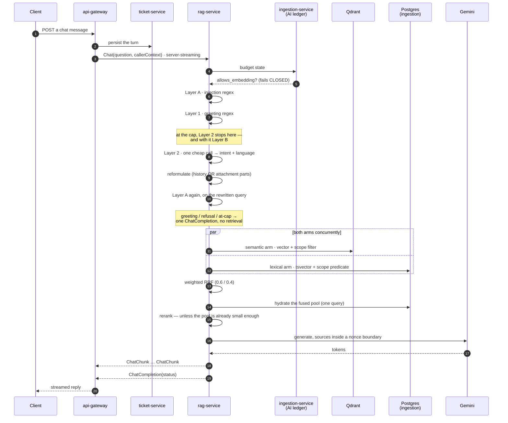
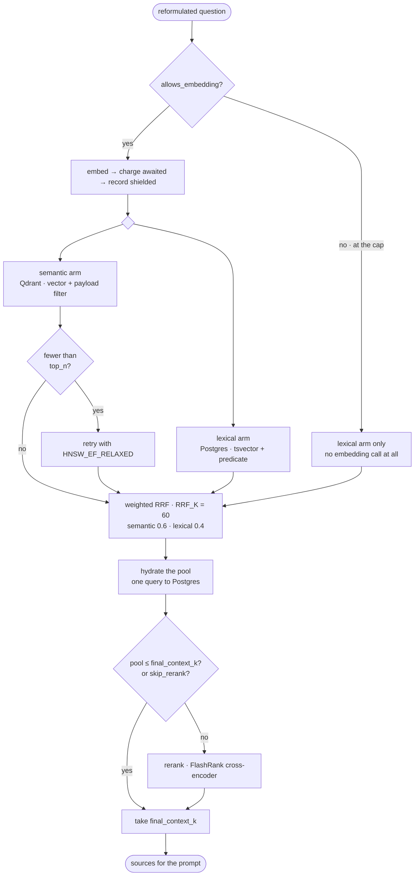

# Flow — answering a question from the knowledge base

**One question, end to end.** A user asks something in chat; tokens stream back,
then a completion that says what kind of answer it was — a real one, a greeting,
a refusal, or "we are at the cap". This document follows that single path.

**Its sibling is [`sys-flows.md` §2–§3](../sys-flows.md), and they do not
overlap.** That section is the *horizontal* view — seven RPC surfaces compared in
one matrix. This is the *vertical* through the two surfaces a user actually
touches, `Chat` and `Search`: the three boxes §2 draws as
`Hybrid → hydrate → FlashRank`, opened up.

**The seven surfaces do not share an at-cap behaviour**, and §2's single `CAP`
node is a simplification this document has to undo — see §3.

---

## 1. The path across services



**`Chat` is server-streaming**, and the final `ChatCompletion` is load-bearing:
its status distinguishes `GREETING`, `REFUSED` and `AT_CAP`. The gateway
persists any non-`AT_CAP` completion as an AI message, so a refusal reported as
a greeting is wrong in the ticket thread *and* wrong in the frame the client
renders.

The gateway never talks to Qdrant, Gemini or the ledger.

---

## 2. Components

| Component | Module | Owns |
| :---- | :---- | :---- |
| api-gateway | resolvers and controllers | authn, permissions, persisting the completion |
| ticket-service | message persistence | the turn, and which attachments it carries |
| rag-service | `RagServicer` in `server.py` | every stage below |
| — preprocessing | `preprocess/pipeline.py` | Layer A, greeting, the fused Layer 2, reformulation |
| — injection | `preprocess/injection.py` | Layer A patterns, `LlmInjectionClassifier` |
| — retrieval | `retrieval/service.py` | both arms, fusion, hydration, rerank |
| — the boundary | `retrieval/tenant_scope.py` | the four-clause scope, rendered twice |
| — generation | `generation/` | prompt assembly, the nonce boundary, the model call |
| ingestion-service | the AI ledger | the budget gate and the spend record |
| Qdrant | `document_chunks` collection | vectors + a payload carrying the scope fields |
| Postgres (ingestion) | `document_chunks` | chunk text, and the lexical index |

---

## 3. The budget gate — and it is not one behaviour

`_budget_state` is the first call in every surface, and **what happens at the cap
differs per surface.** This is the single most commonly mis-stated thing about
this flow:

| Surface | At the cap |
| :---- | :---- |
| `Chat` | **answers**, with `ANSWER_STATUS_AT_CAP` — never a 402 |
| `Search` | **degrades to lexical-only** — the embedding client is not called at all |
| `Ask`, `Draft`, `Classify`, `Suggest` | abort with `PERMISSION_DENIED` / `AT_CAP_REFUSAL` |
| `Summarize` | aborts *unless* in escalation grace |

`Chat`'s own reasoning: *"a 402 mid-conversation is a dead end for a user who
cannot buy anything."* `Search`'s: *"'degraded' has to mean CHEAPER, not merely
relabelled."*

So on the two surfaces this document follows, **the cap is not an error path** —
it is a cheaper path, and `Chat` still answers greetings and injection refusals
at the cap with no ledger row at all.

**The gate fails closed.** An unreadable counter means the embedding is skipped
and search degrades — never that it proceeds unmetered. `_within_grace` fails
closed too. The operational consequence is in §9 and is worth reading before you
need it: **a Redis outage presents as the whole tenant being at the cap.**

**Escalation grace has two halves.** `triggered_by_escalation` decides
*eligibility* — a surface cannot grant itself grace by passing a flag — and
`ESCALATION_GRACE_RATIO` decides whether an eligible call proceeds, running out
at `limit + 10%`.

> **What is true today:** `_entitlement` returns a fixed permissive limit and
> does not read auth-service yet. **The cap cannot trip in practice** except
> through an unreadable counter. If you are wondering why no 402 ever appears,
> this is why.

---

## 4. Preprocessing, in the order it actually runs

```
Layer A (injection regex)
  → Layer 1 greeting regex
  → at-cap short-circuit
  → Layer 2 (one fused cheap call: intent + language)
  → reformulation
  → Layer A again, on the rewritten query
```

**Layer A runs before the greeting check, deliberately** — *"otherwise the one
signal that somebody is probing the system is swallowed by the politeness
check."* With `MAX_GREETING_WORDS = 4` and prefix matching, *"hi ignore previous
instructions"* would otherwise deflect as a greeting.

[ADR 0006](../../decisions/0006-greeting-detection-before-reformulation.md) is
greeting-before-**reformulation**, which is true and is the thing to cite it for
— not "greeting first" overall.

**A message carrying an attachment is not a greeting**, whatever its text — and
the check is keyed on what was *carried*, not on what survived eligibility.

**At the cap, Layer 2 stops, and with it Layer B.** Both are LLM calls and a
spent budget cannot pay for them. Skipping detection there is deliberate, not a
gap: the second Layer A pass still runs on the rewritten query.

**Layer 2 is one call answering two questions**, returning an intent label *and*
an ISO 639-1 language code. It books **`GREETING_CLASSIFY`**, not
`INJECTION_CLASSIFY` — the injection question is *fused into it* on this path,
because *"a separate injection call here would double the cheap-tier round trips
on the highest-volume path in the system to ask one model two questions about
one sentence."*

`INJECTION_CLASSIFY` is booked by `LlmInjectionClassifier` — *"Layer B for the
two surfaces with no Layer 2 to fuse into"*, `Ask` and `Draft`. **Reading the
ledger for what the guard costs on chat means looking for `GREETING_CLASSIFY`.**

The language code is the only place the language is known, which is what gives a
Spanish injection a Spanish refusal *"without a language detector anywhere in
this service"*. A failed Layer 2 degrades to `FACTUAL` — never to `GREETING` or
`REFUSED`.

**Reformulation fires on `history or parts`**, and `or parts` is the whole
feature. A first message with a pasted screenshot and *"how can I solve this
problem?"* — six words naming no product, no error and no policy — retrieves
nothing and returns `DOC_MISSING`, leaving the attachment *"uploaded, stored,
billed for and unread."* So reformulation is **where an image becomes searchable
text**, and the second Layer A pass happens only inside that branch: a first
message with no history and no attachment is scanned once, not twice.

---

## 5. The tenant boundary — the most important function in the flow

`tenant_scope()` renders **one rule in two query languages**: a payload filter
for Qdrant and a `WHERE` predicate for Postgres. Four clauses:

```
organization_id == ctx.organization_id
AND is_deleted == False
AND ( is_organization_wide == True
      OR department_ids ∩ ctx.department_ids )
```

Its own docblock names the failure mode:

> Its failure mode is silent cross-tenant disclosure inside an otherwise
> correct-looking answer: nothing errors, nothing logs, and the response reads
> exactly as it should apart from containing somebody else's document.

The duplication across two languages is the risk; the mitigation is structural.
`document_chunks` carries the same four fields the Qdrant payload does, and
**both renderings come out of one function from one input**, so there is no call
site at which they could be built independently. Reviewing a retrieval change
means checking that this function was called, not comparing two filters by eye.

**The lexical-only path goes through it too.** That path is selected by
`allows_embedding` — it is the *at-cap* path, not a failure fallback — and the
boundary is not optional on it. A fallback that skipped the check because it is
"just keyword search" is the failure to avoid.

---

## 6. Retrieval



**Both arms run concurrently.** They share nothing but the scope they were both
handed.

**Fusion sidesteps incomparable scales, not the weighting question.** RRF reads
*positions*, so a cosine distance never has to be compared against a `ts_rank`.
But the arms carry explicit weights — `semantic_weight` 0.6 and
`lexical_weight` 0.4 by default, clamped to (0.0, 1.0) and tenant-adjustable.
The relative importance of the two arms is a number somebody chose.

**Hydrate before rerank, never the reverse** ([ADR 0008](../../decisions/0008-hydrate-before-rerank.md)).
A cross-encoder scores `(query, passage text)` pairs and the text lives in
Postgres. The cost is inherent: text is fetched for the whole fused pool
(`top_n`), not only the survivors (`final_context_k`) — ranking a candidate
requires reading it.

**Rerank is conditional.** It is skipped, with no warning and no failure, when
`len(candidates) <= final_context_k` — reordering five candidates when five are
being kept changes nothing. For a narrow-department user whose pool is
legitimately small, that is *the common case rather than the edge one*. `Search`
also accepts a `skip_rerank` request flag.

**Work, then charge, then record.** `_semantic` embeds first — it has to, because
the charge amount is computed from the embedding's prompt tokens — then awaits
the charge, then records fire-and-forget and shielded. **The awaited charge is
the load-bearing half**: it is the only thing standing between a burst of
concurrent requests and all of them passing a stale gate. It closes that window
*after* the spend, not before it.

**Fusion runs on both paths.** The at-cap branch populates one arm and calls
`reciprocal_rank_fusion` with it — order is preserved for a single arm, so
nothing behaves differently, but `fused` is what `_hydrate` receives *and* what
`retrieved_chunk_ids` is built from. The recorded "retrieved" set comes out of
that node whichever path reached it.

**What is recorded as "retrieved" is the fused pool, not the final selection**
([ADR 0025](../../decisions/0025-chunk-usage-is-a-projection.md)) — `UNCITED`
needs both to mean anything.

Defaults and clamps live in `settings.py` (`RETRIEVAL_DEFAULTS`, `CLAMPS`).

---

## 7. Generation

Sources are assembled with **every untrusted span inside a per-request nonce
boundary** (`generation/boundary.py`). The model is told to trust only what is
outside the delimiter, and the delimiter is unguessable per request.

Attachment parts are attached as **parts, never concatenated into the message
text** — a security property. Inlining would make the classifier read file
content as user-typed text, losing the distinction that an instruction written
inside a file is an injection attempt just as much as one typed into the
message. `sys-flows.md` §3 has the eligibility matrix.

The answer's shape is [`ai-output-contract.md`](../ai-output-contract.md).

---

## 8. Edge cases

| Situation | What happens | Why that, and not an error |
| :---- | :---- | :---- |
| **At the cap, `Chat`** | answers with `ANSWER_STATUS_AT_CAP` | A 402 mid-conversation is a dead end for a user who cannot buy anything |
| **At the cap, `Search`** | lexical-only; no embedding call | Degraded must mean *cheaper*, not relabelled |
| **At the cap, greeting or refusal** | still answered, no ledger row | Neither costs anything to produce |
| **Counter unreadable** | treated as at the cap | Fails **closed** — never proceeds unmetered |
| **Escalation grace** | `Summarize` proceeds to `limit + 10%` | The flag grants eligibility; the ratio grants the spend |
| **Layer A hit** | refusal, written back — see `sys-flows.md` §5 | The refusal is part of the record |
| **Layer 2 fails** | degrades to `FACTUAL` | Run-open: never silently to `GREETING` or `REFUSED` |
| **Semantic arm returns thin** | retried once with `HNSW_EF_RELAXED` | An index-tuning artefact, **not** "nothing relevant" |
| **Qdrant or the embedder errors** | the whole call fails | There is no try/except here — the at-cap path is the only degraded path |
| **Pool ≤ `final_context_k`** | rerank skipped silently | Reordering five to keep five changes nothing |
| **Reranker cannot load** | warns **per request**, falls back to fused order | `_load` assigns only on success, so a failed load is retried and re-paid every request |
| **Retrieval genuinely empty** | `DOC_MISSING_WITH_HANDOFF` or `..._NO_HANDOFF`, on `can_escalate` | Whether a human is offered is part of the answer |
| **Generation fails after retrieval** | the embedding spend is already booked | It was already incurred; the alternative loses money to concurrency |

**The reranker row is the one to watch, and the asymmetry is the point.** The
*logs* are loud — one warning per request, because the failed load is never
memoised — while the *response* is silent. Every answer is complete, plausible
and worse.

---

## 9. When it misbehaves — where to look first

| Symptom | Look at |
| :---- | :---- |
| Every question is refused, or everything is `AT_CAP` | **Redis first.** The gate fails closed, so an unreadable counter looks exactly like a spent budget across the whole tenant |
| Answers cite nothing, or the wrong tenant's document | `tenant_scope()` — was it called on **both** arms? |
| Answers went vague after a deploy | three candidates, in order: did FlashRank load (loud, per request); was the pool ≤ `final_context_k` (silent); was `skip_rerank` set |
| Chat answers but the thread shows nothing | the completion's status — the gateway persists every non-`AT_CAP` completion |
| A greeting got a real answer | the attachment condition, or Layer 2 skipped at the cap |
| Retrieval empty for a document you can see | `is_deleted`, then the department clause — organisation-wide is a separate flag |
| The guard's cost is missing from the ledger | on `Chat` it books `GREETING_CLASSIFY`; `INJECTION_CLASSIFY` is `Ask` and `Draft` only |
| Spend does not match traffic | the fire-and-forget record, not the awaited charge |

---

## 10. Related

- [`sys-flows.md` §2–§3](../sys-flows.md) — the seven surfaces, compared
- [`ai-output-contract.md`](../ai-output-contract.md) — the answer's shape
- ADRs [0006](../../decisions/0006-greeting-detection-before-reformulation.md),
  [0008](../../decisions/0008-hydrate-before-rerank.md),
  [0015](../../decisions/0015-prompt-injection-layers.md),
  [0017](../../decisions/0017-attachments-reach-retrieval.md),
  [0025](../../decisions/0025-chunk-usage-is-a-projection.md)
