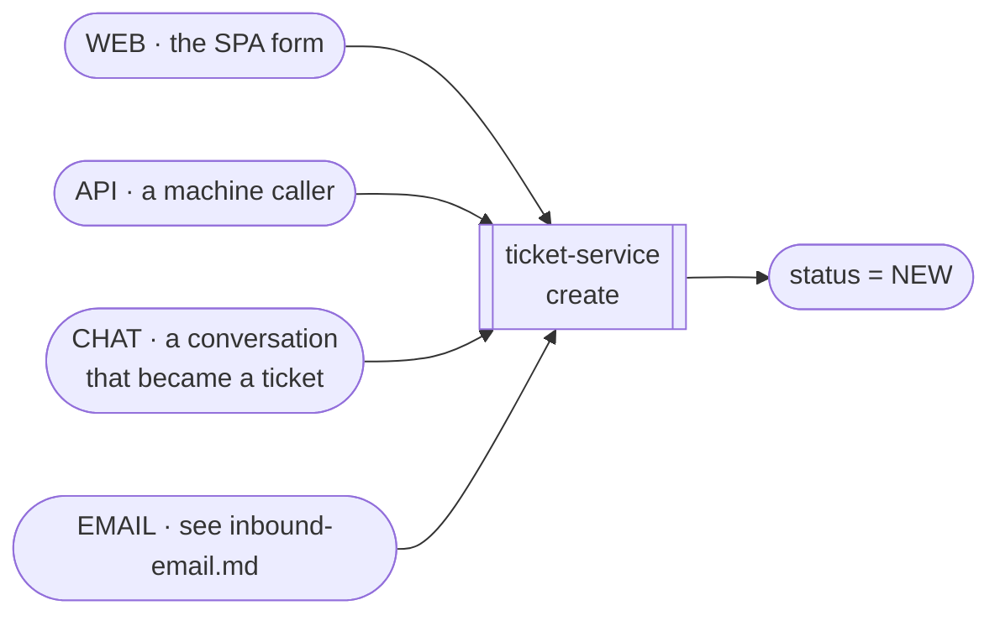
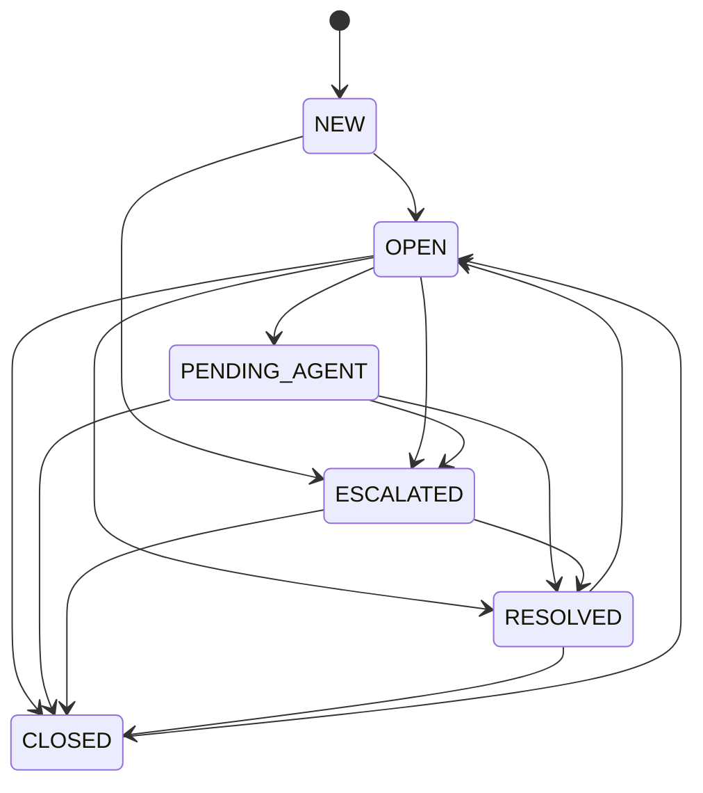

# Flow — a ticket, from three doors to closed

**One ticket, cradle to grave.** How it is created, who it belongs to, how its status moves, and which of those moves are refused.

Two neighbouring flows are deliberately not here: [`inbound-email.md`](./inbound-email.md) covers the email door in detail (it spans a runtime outside the cluster), and [`notification-delivery.md`](./notification-delivery.md) covers what happens *after* an event is published.

---

## 1. Three doors, one ticket

`TicketSource` is `WEB`, `CHAT`, `EMAIL` or `API`, and the source is recorded on the row because it changes almost nothing downstream — deliberately.

**A door is a paragraph; a door with its own runtime is a flow.** `WEB`, `API` and `CHAT` differ only in who calls the gateway and what the client already knows. `EMAIL` arrives through a Cloudflare Worker with its own deploy path, shared secret and idempotency rule, which is why it has a document.

Everything past `CREATE` is identical regardless of door.

---

## 2. The state machine

`TICKET_STATUS_TRANSITIONS` is the single encoding, and `canTransition()` is the one question it answers. **Three edges are absent on purpose**, and its own docblock says why:

- **Nothing returns to `NEW`.** It means *"nobody has looked at this yet"*, which stops being true permanently.
- **`RESOLVED` and `CLOSED` reopen to `OPEN`, never to `NEW` or `PENDING_AGENT`.** A reopened ticket is work in progress; routing it back through triage would lose its history of having been handled.
- **`ESCALATED` cannot fall back to `OPEN`.** De-escalation is a *reassignment* decision, not a status one, and conflating them would let a status change silently move a ticket off a tier-2 queue.

**`escalate`, `resolve`, `reopen` and `close` are one operation.** They are convenience RPCs over the generic status change and they all call one validator reading this table. If each carried its own idea of what it may transition from, `POST /tickets/:id/resolve` and `POST /tickets/:id/status` would diverge the first time one was updated.

An illegal edge is an **error**, not a silent no-op — on REST and in the `transitionTicketStatus` mutation alike.

---

## 3. Assignment

Assignment is a row in `ticket_assignments`, not a column on the ticket, so the history survives reassignment. The current one is marked `is_current = true`, and a **partial unique index on that flag** is what makes "one live assignee" true rather than intended.

The seeder's own comment names the failure it prevents: *"two concurrent reassigns would both succeed and the ticket would have two live assignees with no way to tell which is real."* A service-layer check is correct in isolation and loses the race; the index cannot.

That index is created by `applySchemaObjects()` in the deploy step, not by Prisma — see [ADR 0039](../../decisions/0039-the-seeder-ddl-block-is-the-list.md). A database that skipped it looks entirely normal until two agents click at once.

---

## 4. Escalation

`escalateTicket` is the one transition an **end user** may perform on their own ticket. Everything else is an agent action.

It publishes `TICKET_PATTERNS.escalated` and stamps `escalatedAt` — **on every escalation, not only the first.** `transitionSideEffects` returns `{ escalatedAt: new Date() }` unconditionally for that status, and `ESCALATED → RESOLVED → OPEN → ESCALATED` is reachable through the table drawn above.

What *is* deliberately preserved is the **reopen** case: reopening clears `resolvedAt` — leaving it set would make every time-to-resolution metric count a ticket that is open again — and keeps `escalatedAt`, because *"the ticket really was escalated once, and that is history."*

The consequence is worth stating rather than papering over: **analytics measure from the latest escalation, not the first.** For a ticket escalated twice, the first escalation's duration is not recoverable from this column.

**The publish does not gate the escalation.** An escalation is the agent's action and must succeed on its own terms; a broker that is down produces an escalated ticket and a missing notification, not a failed escalation. That is the same asymmetry every fire-and-forget publish in this system takes, and it is why the notification flow has a reconciliation story rather than a delivery guarantee.

---

## 5. Messages, and what a reader is allowed to see

A ticket's thread is `ticket_messages`. Two rules shape every read:

**Internal notes are stripped at read time, before serialization** ([ADR 0023](../../decisions/0023-internal-notes-are-stripped-before-serialization.md)). Not filtered in the query, not hidden by the client — removed by ticket-service before the rows leave it, so REST, GraphQL's `Ticket.messages` and the WebSocket fan-out cannot disagree about who sees what.

**The thread is capped, not paginated, over GraphQL.** `Ticket.messages(first:)` returns the head of the thread oldest-first and there is no second page; a thread longer than 100 messages needs the REST list. See [`graphql-api.md`](../../graphql-api.md) §7.

---

## 6. Status history

Status changes are rows in a table, not entries in an audit trail ([ADR 0040](../../decisions/0040-ticket-status-history-is-a-table-not-a-trail.md)). The distinction matters for analytics: resolution-time rollups read this table directly, and an audit trail — append-only, cross-service, differently shaped — would make that a join across a service boundary that [ADR 0022](../../decisions/0022-no-cross-service-fks.md) forbids.

---

## 7. Edge cases

| Situation | What happens | Why that, and not an error |
| :---- | :---- | :---- |
| **Illegal transition** | rejected with the legal set named | One table, one validator; the convenience RPCs cannot drift from it |
| **Two concurrent reassigns** | one wins, the other hits the partial unique index | The index is the control; the service check exists for the 99.99% case's error message |
| **Re-escalation** | allowed where the table allows it; `escalatedAt` **is** reset | Unconditional on the status; analytics therefore measure from the latest |
| **Escalation with NATS down** | ticket escalates, notification is lost | The agent's action must not depend on the broker |
| **End user tries to resolve** | refused | `escalate` is the only end-user transition |
| **Reopen after close** | `CLOSED → OPEN`, never to `NEW` | The ticket has been handled; triage would lose that |
| **Message on a closed ticket** | allowed | Closing is not locking. Whether a reply *automatically* reopens is a caller decision, not a side effect of the message |
| **Internal note requested by an end user** | never serialized | Stripped before the rows leave ticket-service, on all three surfaces |

---

## 8. When it misbehaves — where to look first

| Symptom | Look at |
| :---- | :---- |
| A ticket has two assignees | `ticket_assignments_current_key` — does the index exist in this database? |
| `resolve` works and `status` does not (or vice versa) | they share one validator; the divergence is in the caller, not the table |
| Escalation happened but nobody was told | the publish is fire-and-forget — check the notification flow, not ticket-service |
| An agent sees a note an end user also sees | the strip is at read time in ticket-service; a new read path that bypasses it is the bug |
| Resolution-time analytics look wrong | the status history table; a reopen clears `resolvedAt`, and a re-escalation moves `escalatedAt` |
| A thread stops at 100 messages | `Ticket.messages` is a cap, not a page — use REST |

---

## 9. Related

- [`inbound-email.md`](./inbound-email.md) — the email door, in full
- [`notification-delivery.md`](./notification-delivery.md) — what the published events become
- [`analytics.md`](./analytics.md) — what the status history is read for
- ADRs [0022](../../decisions/0022-no-cross-service-fks.md), [0023](../../decisions/0023-internal-notes-are-stripped-before-serialization.md), [0039](../../decisions/0039-the-seeder-ddl-block-is-the-list.md), [0040](../../decisions/0040-ticket-status-history-is-a-table-not-a-trail.md)
