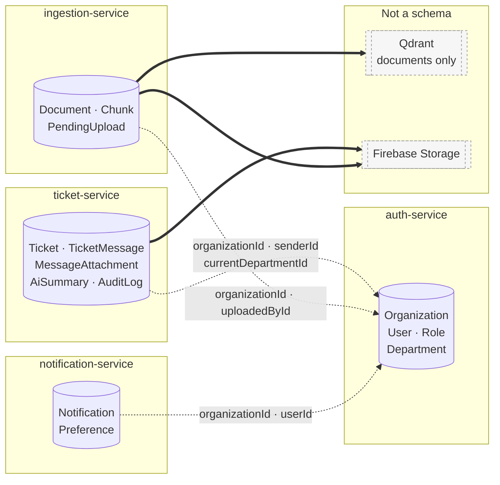
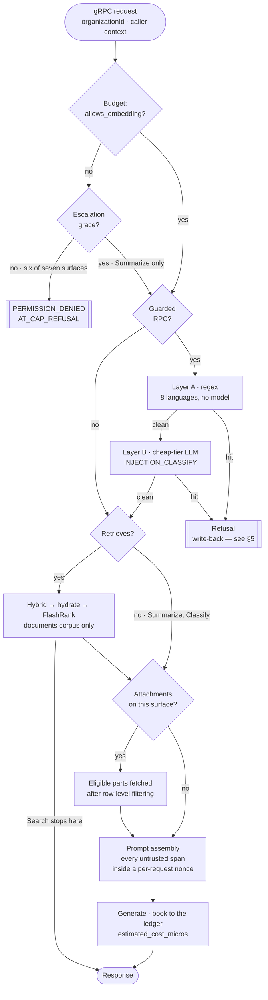
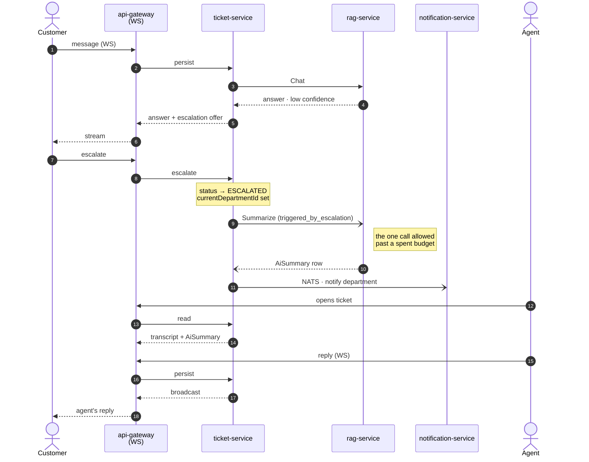

# Cross-service flows

The flows no single service can show you. Anything visible inside one schema is in [`erd/`](./erd/) and generated; anything visible inside one endpoint is in Swagger. What is left is here.

---

## 1. The ownership map

Four Prisma schemas, no foreign keys between them. Prisma cannot express a relation across schemas and the cross-service edges are absent from every schema deliberately — see [ADR 0022](../decisions/0022-no-cross-service-fks.md). The edges below are therefore **id columns validated at write time over gRPC**, not constraints. Nothing in the database enforces them.

Dashed edges are unenforced references. Solid edges are stores with no schema at all, so nothing there cascades either — a deleted `Document` row leaves its vectors and its object behind unless the deleting code removes them.

**The corpus is documents-only.** No ticket text is ever embedded into Qdrant; `Chunk` rows carry the `document_id` that vectors point back to. A ticket becomes retrievable only by being written up as a knowledge document.

---

## 2. The AI request pipeline

Seven RPCs on `rag-service`. They share one spine, and the useful thing to know is not the spine — it is which stage each surface skips. So the spine is drawn once here, and §3 is the matrix of who takes which branch.

**There is no per-surface diagram, on purpose.** Six near-identical pictures diverging on three nodes each is six things to keep in step; a matrix is one.

Five things this spine is load-bearing for:

- **The cap is checked before anything else.** Every one of the seven aborts with `PERMISSION_DENIED` / `AT_CAP_REFUSAL` and does no work first.
- **The grace branch exists once.** `Summarize` is the only surface that can proceed past a spent budget, and only when the caller sets `triggered_by_escalation` — the flag is not the authority, the escalation is.
- **The guard is not on every surface**, and the reasons are recorded per RPC in the code rather than inferred — see §3 and [ADR 0015](../decisions/0015-prompt-injection-layers.md).
- **Attachments reach retrieval, not only generation** — [ADR 0017](../decisions/0017-attachments-reach-retrieval.md). This is why `PARTS` sits before `PROMPT` and not inside it.
- **`Search` leaves before generation.** It is the one surface that returns retrieved chunks and never calls a generation model, which is also why it is the one surface with no nonce boundary — nothing assembles a prompt. The hydrate-before-rerank ordering inside `DOCS` is [ADR 0008](../decisions/0008-hydrate-before-rerank.md).

---

## 3. Where the seven surfaces differ

| | `Search` | `Chat` | `Ask` | `Draft` | `Summarize` | `Classify` | `Suggest` |
| :---- | :--: | :--: | :--: | :--: | :--: | :--: | :--: |
| Cap abort | ✓ | ✓ | ✓ | ✓ | ✓ | ✓ | ✓ |
| Escalation grace | — | — | — | — | **✓** | — | — |
| Injection guard (A+B) | — | ✓ | ✓ | ✓ | — | — | — |
| Greeting detection | — | **✓** | — | — | — | — | — |
| Reformulation | — | ✓ | — | — | — | — | — |
| Retrieval | ✓ | ✓ | ✓ | ✓ | — | — | ✓ |
| Attachments | — | ✓ | — | ✓ | — | ✓ | — |
| Review + refine | — | — | — | **✓** | — | — | — |
| Nonce boundary | — | ✓ | ✓ | ✓ | ✓ | ✓ | ✓ |
| Ledger purpose | `EMBEDDING` | `CHAT_ANSWER` | `CHAT_ANSWER` | `DRAFT` | `SUMMARY` | `CLASSIFY` | `SUGGESTIONS` |

Plus the purposes booked by stages rather than surfaces: `GREETING_CLASSIFY` and `REFORMULATION` inside `Chat`'s preprocessing, `INJECTION_CLASSIFY` inside Layer B, `REVIEW` inside `Draft`'s critique pass, `EMBEDDING` wherever retrieval runs.

### Why four surfaces carry no injection guard

Recorded at the guard itself, not here, so the two cannot drift:

| RPC | Reason |
| :---- | :---- |
| `Summarize` | output is a summary shown to an agent, not shaped by a question |
| `Classify` | output is a department id and a priority — a constrained choice |
| `Suggest` | output is a fixed set of suggested actions |
| `Search` | retrieval only — no model ever sees the query text |

The distinction is **whether an attacker's text can steer a free-form answer to a human**, not whether untrusted text is present. It is present in all seven. That is why the nonce boundary covers six of them while the guard covers three: the boundary is about the model reading a delimiter, the guard is about the answer being weaponisable.

### Draft's extra pass

`Draft` is the only surface that generates twice: a draft, a critique on the **cheap** tier, and a refine on the generation tier when the critique asks for one. The refine books under `DRAFT`, not under a purpose of its own — deliberately, so the text the agent actually sends is attributed to the surface that produced it. Only the critique books `REVIEW`.

### Which attachments each surface sees

Three surfaces take attachments and each selects a different message, because each is answering a different question:

| Surface | Message selected | Refused turns |
| :---- | :---- | :---- |
| `Chat` | the message being sent *(gateway fetches; the rule lives in ticket-service)* | excluded |
| `Draft` | the newest **user** message, skipping AI replies | excluded |
| `Classify` | the **earliest** message on the ticket | **included** |

`Classify` is the deliberate exception: a refused opening message is still the opening message, and routing a ticket is not answering its author. The other two follow [ADR 0030](../decisions/0030-refused-turns-exclude-their-attachments.md) — exclusion is **per turn, not per file**, and it reaches the files and not only the text. A user who sends injection text plus a screenshot has both dropped.

Eligibility is decided from the row — mime type and `fileSizeBytes` — before any download. A caller that fetched first and filtered after would pay for every zip anyone ever attached.

---

## 4. Escalation handoff

The flow that spans the most services: a customer asks, the AI cannot answer, a human picks it up.

Two properties worth not rediscovering:

- **The summary is fire-and-forget.** Escalation does not wait for it and does not fail if it fails. The agent may open a ticket that has no summary yet.
- **WebSocket is a transport, not a second write path** ([ADR 0011](../decisions/0011-websocket-is-a-transport.md)) — every arrow into `ticket-service` above is the same write path the REST route uses.

---

## 5. The refusal write-back

What a guard hit actually does, across two services. This is the loop that makes [ADR 0030](../decisions/0030-refused-turns-exclude-their-attachments.md) enforceable rather than aspirational.

The flag is written on the **message**, which is why one boolean removes both the sentence and the screenshot. The three transcript builders and two of the three attachment selectors read it; `Classify`'s selector deliberately does not (§3).

A refused message is still visible to humans. Unlike an internal note — which is stripped before serialization, [ADR 0023](../decisions/0023-internal-notes-are-stripped-before-serialization.md) — a refusal is the customer's own text and hiding it from them would be a different product decision than the one that was made. The exclusion is from the **model's** context only.
