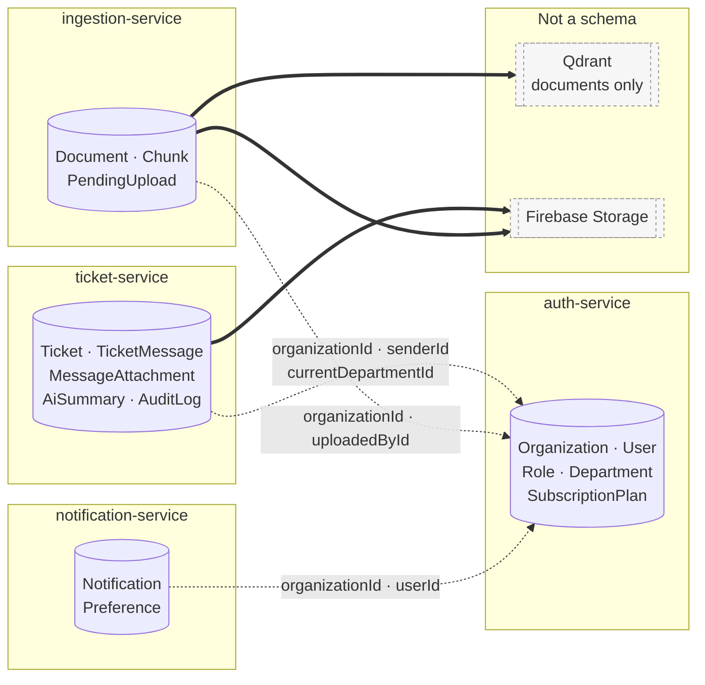
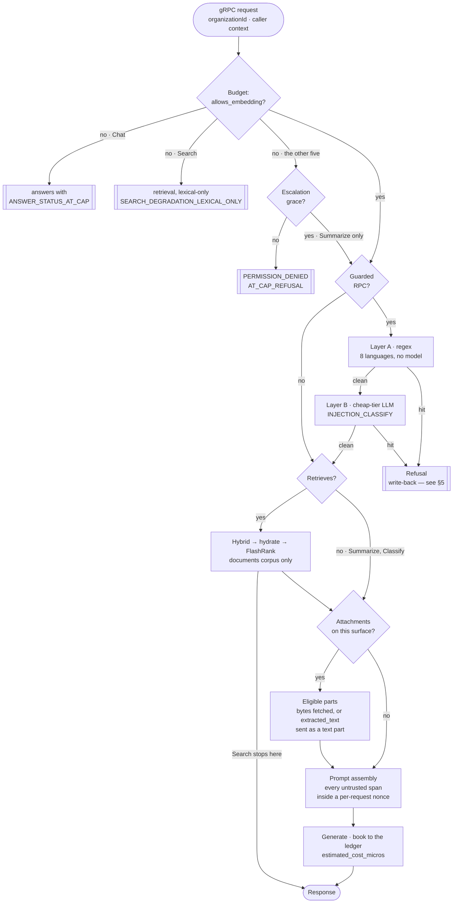
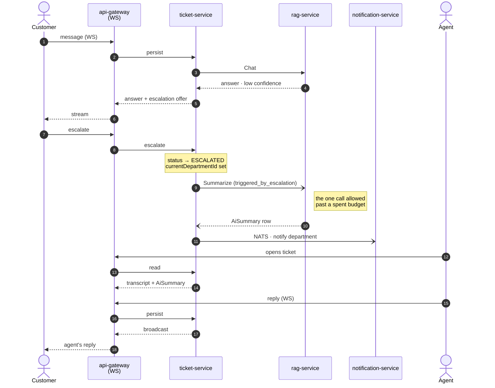
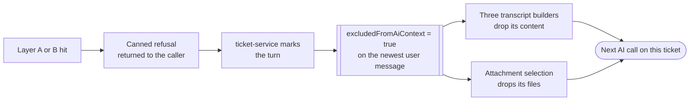
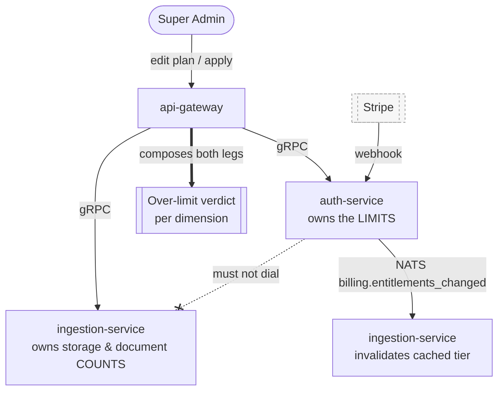

# Cross-service flows

The flows no single service can show you. Anything visible inside one schema is in [`erd/`](./erd/) and generated; anything visible inside one endpoint is in Swagger. What is left is here.

---

## 1. The ownership map

Four Prisma schemas, no foreign keys between them. Prisma cannot express a relation across schemas and the cross-service edges are absent from every schema deliberately — see [ADR 0022](../decisions/0022-no-cross-service-fks.md). The edges below are therefore **id columns validated at write time over gRPC**, not constraints. Nothing in the database enforces them.

Dashed edges are unenforced references. Solid edges are stores with no schema at all, so nothing there cascades either — a deleted `Document` row leaves its vectors and its object behind unless the deleting code removes them.

**Two of those solid edges have a detector.** `document_chunks` carries four denormalized scope columns that the lexical retrieval arm filters on, and `ScopeWriterService.apply()` keeps them in step by writing Postgres *and* Qdrant — two stores that cannot share a transaction. Its ordering makes each partial failure fail safely in one direction, but nothing checked that the second write landed, so every failure mode left a durable, silent inconsistency. The hourly `scope-reconcile` job is that check:

- **Repair goes through `apply()`, never a second writer.** A second implementation of the comparison is a second thing that can disagree with the first, and a sweep that repaired what the fan-out considers fine would fight it forever. The SQL is only a *candidate filter* — a false candidate costs one verdict call and is dropped; what it must never do is **miss** a drifting document, because nothing downstream would look at it again.
- **Chunks wider than the truth are reported separately**, not averaged into a maintenance number. A restriction whose chunk write failed leaves the lexical arm answering with the old, wider scope — someone retrieves a document they were removed from. That is an access-control failure that was being served, and it reads as a statistic if you total it with the rest.
- **`organization_id` mismatches are reported and never repaired.** A chunk disagreeing with its document about which tenant it belongs to is not drift to smooth over.
- **The run is capped and says so.** Repair is a Qdrant write plus a chunk `updateMany` per document, so an unbounded run over a large drift set is the sweep becoming the incident. Anything past the cap is reported and picked up next hour — never silently truncated.

**The corpus is documents-only.** No ticket text is ever embedded into Qdrant; `Chunk` rows carry the `document_id` that vectors point back to. A ticket becomes retrievable only by being written up as a knowledge document.

---

## 2. The AI request pipeline

Seven RPCs on `rag-service`. They share one spine, and the useful thing to know is not the spine — it is which stage each surface skips. So the spine is drawn once here, and §3 is the matrix of who takes which branch.

**There is no per-surface diagram, on purpose.** Six near-identical pictures diverging on three nodes each is six things to keep in step; a matrix is one.

Five things this spine is load-bearing for:

- **The cap is checked before anything else, and what happens at it differs per surface.** `Chat` **answers** with `ANSWER_STATUS_AT_CAP` — the caller escalates to a human, because a 402 mid-conversation is a dead end for a user who cannot buy anything. `Search` **degrades** to lexical-only retrieval and never calls the embedding client — "degraded" has to mean cheaper, not merely relabelled. `Suggest` **degrades the same way, halfway**: its next steps need the model and are refused, its articles are the same keyword retrieval `Search` runs and come back with `degraded = LEXICAL_ONLY`, and no ledger row is written. The other four abort with `PERMISSION_DENIED` / `AT_CAP_REFUSAL` and do no work first, `Summarize` excepted when in grace. `AT_CAP_POLICY` in `ai-pricing.config.ts` is the table, keyed by *surface* — what the caller does when there is no money — which is why `KNOWLEDGE_SEARCH` and `SUGGESTIONS` both read `DEGRADE` while `Suggest`'s generation half is still refused.
- **The grace branch exists once.** `Summarize` is the only surface that can proceed past a spent budget, and only when the caller sets `triggered_by_escalation` — the flag is not the authority, the escalation is.
- **The guard is not on every surface**, and the reasons are recorded per RPC in the code rather than inferred — see §3 and [ADR 0015](../decisions/0015-prompt-injection-layers.md).
- **Attachments reach retrieval, not only generation** — [ADR 0017](../decisions/0017-attachments-reach-retrieval.md). This is why `PARTS` sits before `PROMPT` and not inside it.
- **`Search` leaves before generation.** It is the one surface that returns retrieved chunks and never calls a generation model, which is also why it is the one surface with no nonce boundary — nothing assembles a prompt. The hydrate-before-rerank ordering inside `DOCS` is [ADR 0008](../decisions/0008-hydrate-before-rerank.md).

---

## 3. Where the seven surfaces differ

| | `Search` | `Chat` | `Ask` | `Draft` | `Summarize` | `Classify` | `Suggest` |
| :--- | :---: | :---: | :---: | :---: | :---: | :---: | :---: |
| At the cap | **lexical-only** | **answers `AT_CAP`** | abort | abort | abort *unless in grace* | abort | **articles only**, `degraded` |
| Escalation grace | — | — | — | — | **✓** | — | — |
| Injection guard (A+B) | — | ✓ | ✓ | ✓ | — | — | — |
| Greeting detection | — | **✓** | — | — | — | — | — |
| Reformulation | — | ✓ | — | — | — | — | — |
| Retrieval | ✓ | ✓ | ✓ | ✓ | — | — | ✓ |
| Attachments | — | ✓ | — | ✓ | — | ✓ | — |
| Review + refine | — | — | — | **✓** | — | — | — |
| Nonce boundary | — | ✓ | ✓ | ✓ | ✓ | ✓ | ✓ |
| Ledger purpose | `EMBEDDING` | `CHAT_ANSWER` | `CHAT_ANSWER` | `DRAFT` | `SUMMARY` | `CLASSIFY` | `SUGGESTIONS` |

Plus the purposes booked by stages rather than surfaces: `GREETING_CLASSIFY` and `REFORMULATION` inside `Chat`'s preprocessing, `INJECTION_CLASSIFY` inside Layer B, `REVIEW` inside `Draft`'s critique pass, `EMBEDDING` wherever retrieval runs.

### Why four surfaces carry no injection guard

Recorded at the guard itself, not here, so the two cannot drift:

| RPC | Reason |
| :--- | :--- |
| `Summarize` | output is a summary shown to an agent, not shaped by a question |
| `Classify` | output is a department id and a priority — a constrained choice |
| `Suggest` | output is a fixed set of suggested actions |
| `Search` | retrieval only — no model ever sees the query text |

The distinction is **whether an attacker's text can steer a free-form answer to a human**, not whether untrusted text is present. It is present in all seven. That is why the nonce boundary covers six of them while the guard covers three: the boundary is about the model reading a delimiter, the guard is about the answer being weaponisable.

### Draft's extra pass

`Draft` is the only surface that generates twice: a draft, a critique on the **cheap** tier, and a refine on the generation tier when the critique asks for one. The refine books under `DRAFT`, not under a purpose of its own — deliberately, so the text the agent actually sends is attributed to the surface that produced it. Only the critique books `REVIEW`.

### Which attachments each surface sees

Three surfaces take attachments and each selects a different message, because each is answering a different question:

| Surface | Message selected | Refused turns |
| :--- | :--- | :--- |
| `Chat` | the message being sent *(gateway fetches; the rule lives in ticket-service)* | excluded |
| `Draft` | the newest **user** message, skipping AI replies | excluded |
| `Classify` | the **earliest** message on the ticket | **included** |

`Classify` is the deliberate exception: a refused opening message is still the opening message, and routing a ticket is not answering its author. The other two follow [ADR 0030](../decisions/0030-refused-turns-exclude-their-attachments.md) — exclusion is **per turn, not per file**, and it reaches the files and not only the text. A user who sends injection text plus a screenshot has both dropped.

Eligibility is decided from the row — mime type and `fileSizeBytes` — before any download. A caller that fetched first and filtered after would pay for every zip anyone ever attached.

### Three ways an attachment reaches the model

Of the **12 storable** MIME types, 9 are natively AI-eligible and 2 more are *parse-eligible*. That is three branches, not two:

| Attachment | What is sent |
| :--- | :--- |
| Natively AI-eligible (`png`, `jpeg`, `webp`, `heic`, `heif`, `pdf`, `plain`, `markdown`, `csv`) | the bytes, downloaded per turn |
| Parse-eligible (`docx`, `xlsx`) **with** `extracted_text` | the **text**, as a part — no download at all |
| Anything else, or `extracted_text` NULL/empty | **skipped**, reported to the user by name |

The middle row removes a runtime dependency: those attachments stop being fetched from storage on every AI turn, so "the object is missing from Firebase" disappears for them rather than being handled. Extraction runs **once**, at `POST .../attachments/confirm`, into `message_attachments.extracted_text` (RDM Table 15) — a workbook's sheets live inside that markdown as `## Sheet: …` headings, so nothing downstream branches on format.

**It is sent as a part, never concatenated into the message content**, and that is a security property rather than a style choice. Inlining would change what `MAX_MESSAGE_CONTENT_LENGTH` bounds, pollute the transcript later reformulations read, and — the one that matters — make the injection classifier see file content as *user-typed text*, losing the exact distinction the attachment note draws: an instruction written **inside** a file is an injection attempt just as much as one typed in the message. Kept as a part, the existing Layer A/B defence applies unchanged.

Parsing does widen the attack surface: a `.docx` could not reach the model at all before, so a docx-borne injection had no path. Not a new class — PDF and txt already carry it — but a quieter carrier, in white footer text, a hidden column, a comment. Nobody glancing at the file sees it.

**`.doc` is deliberately not in either eligible list.** It is storable as an attachment and nothing parses it, and it was *removed* from the document pipeline entirely — a real `.doc` is an OLE compound file, not a zip, so the parser fails with a bare error that costs three retries. `image/gif` is not storable at all: Gemini does not support it, so it was removed rather than demoted.

---

## 4. Escalation handoff

The flow that spans the most services: a customer asks, the AI cannot answer, a human picks it up.

Two properties worth not rediscovering:

- **The summary is fire-and-forget.** Escalation does not wait for it and does not fail if it fails. The agent may open a ticket that has no summary yet.
- **WebSocket is a transport, not a second write path** ([ADR 0011](../decisions/0011-websocket-is-a-transport.md)) — every arrow into `ticket-service` above is the same write path the REST route uses.

---

## 5. The refusal write-back

What a guard hit actually does, across two services. This is the loop that makes [ADR 0030](../decisions/0030-refused-turns-exclude-their-attachments.md) enforceable rather than aspirational.

The flag is written on the **message**, which is why one boolean removes both the sentence and the screenshot. The three transcript builders and two of the three attachment selectors read it; `Classify`'s selector deliberately does not (§3).

A refused message is still visible to humans. Unlike an internal note — which is stripped before serialization, [ADR 0023](../decisions/0023-internal-notes-are-stripped-before-serialization.md) — a refusal is the customer's own text and hiding it from them would be a different product decision than the one that was made. The exclusion is from the **model's** context only.

---

## 6. Entitlements: who may ask whom

Plans grant limits; two different services hold the numbers those limits are checked against. The shape of this section is set by one constraint that is easy to violate and expensive to discover:

**`ingestion-service` dials `auth-service` on every presign, so `auth-service` must never dial back.** Storage bytes and document counts are ingestion's to count. Auth owns the limit and cannot ask what the usage is.

**The gateway is the composer, not a convenience.** Auth answers `seats` from its own tables; ingestion answers `storage` and `documents`. Neither can produce the whole verdict, so the gateway unions the two legs — and **reports which dimensions each run actually covered**. A leg that does not respond drops its dimensions from that run's coverage rather than silently reporting nobody affected: an unevaluated dimension and an evaluated-and-clear one are different answers, and collapsing them would let a downgrade through on the strength of a timeout.

### Every layer narrows; no layer widens

Four values can bound one upload, and the effective limit is the `min()` of all of them:

| Layer | Where | Can it widen? |
| :--- | :--- | :--- |
| Platform ceiling (`MAX_DOCUMENT_BYTES`) | code constant | — it *is* the ceiling |
| Plan grant (`subscription_plans`, Table 40) | catalogue row | **No** — a plan may only narrow |
| Denormalized grant (`organizations.max_document_bytes`) | tenant row | copy of the above, read on the hot path |
| Tenant override (`…_override`, Table 1) | tenant row | **No** — the edge *refuses* a value above the ceiling rather than clamping it |

The grant is denormalized onto the tenant deliberately: enforcement reads **one row**, and a join to the catalogue on every presign would put the plan table in the hot path of the highest-volume route in the system. `entitlements_pinned` is what stops the next routine webhook — a renewal, a card update — re-deriving those columns from the price and silently reverting a negotiated seat count.

### The limit alarm, and why its counter is durable

A workspace nearing a ceiling is told before it arrives. The alarm has two pieces of state deliberately kept in different stores:

- **The level** lives in Redis. Losing it costs at most one duplicate alert.
- **The generation** lives in Postgres (`limit_alert_generations`, Table 42), and it cannot join it.

The alert's `notifications.event_id` is derived, and Domain E holds a **permanent** `UNIQUE (recipient_id, event_id)`. So a workspace that crosses 80%, frees space, and crosses again would republish an id that guard already holds — and the second alert would be dropped as a duplicate the tenant never sees. The generation counter makes each crossing a new event.

Put that counter in Redis beside the level and one flush resets it to zero; the next crossing republishes a held id, and **that dimension stops alerting for that tenant permanently**, from a transient failure. A counter that steps past a permanent guard must outlive it.

It increments once per **recovery**, never per threshold cleared — falling from 100% to 5% is one recovery, not three.
